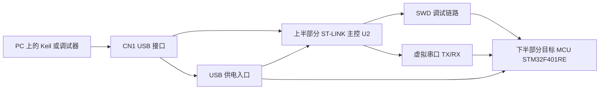
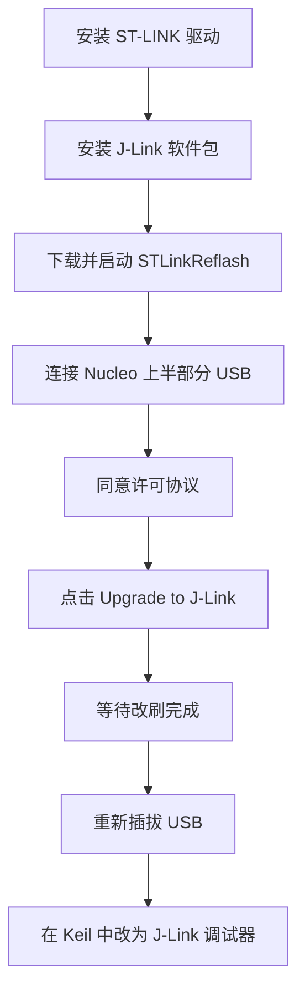

# Nucleo 开发板上半部分分析

## 1. 说明对象

本文分析本项目所使用的 `Nucleo-F401RE` 开发板上半部分结构。  
从目标 MCU 角度看，核心器件为 `STM32F401RET6/RETx`。整块板在功能上可以分成两部分：

- 上半部分：板载 `ST-LINK` 调试下载区
- 下半部分：目标 MCU 应用区

上半部分并不是运行飞控业务逻辑的区域，而是开发辅助子系统，负责程序下载、在线调试、虚拟串口和供电入口管理。

## 2. 上半部分的总体作用

当电脑通过 USB 线连接开发板时，并不是直接连到目标 MCU，而是先连接到上半部分的板载 `ST-LINK` 电路。  
之后由 `ST-LINK` 通过 `SWD` 与下半部分目标 MCU 建立连接。

因此，上半部分承担了以下职责：

- 接收 PC 端调试器或下载工具的命令
- 把 USB 通信转换成 `SWD` 调试下载信号
- 提供虚拟串口桥接能力
- 作为常用的供电输入入口

## 3. 关键器件与接口

### 3.1 CN1：USB 接口

`CN1` 是开发板上半部分最重要的入口，主要作用有：

- 连接 PC
- 给板载 `ST-LINK` 供电
- 提供程序下载与调试通道
- 提供虚拟串口数据通道

对使用者来说，平时插上的那根 USB 线，本质上首先连接的是上半部分调试子系统。

### 3.2 U2：板载 ST-LINK 主控

`U2` 是上半部分的核心控制器，可以理解为一颗专门用于调试和桥接的 MCU。它负责：

- 处理与 PC 的 USB 通信
- 把上位机调试协议转换成 `SWD` 信号
- 协助完成下载、断点、单步和寄存器查看
- 在支持的配置下提供虚拟串口功能

所以在实际开发中，Keil 与开发板建立会话时，首先打交道的是 `U2`，然后才是下半部分目标 MCU。

### 3.3 SWD 相关接口与跳帽

上半部分还包含若干和 `SWD` 相关的接口、排针或跳帽，其主要作用是把以下信号送到目标 MCU：

- `SWDIO`
- `SWCLK`
- `NRST`
- `GND`

这些信号共同构成程序烧录和在线调试的核心链路。

### 3.4 TX/RX 串口桥接

部分排针或跳帽用于连接板载虚拟串口与目标 MCU 的串口引脚。  
这样做的结果是：PC 端通过 USB 看到一个串口设备，而底层数据实际上由上半部分 `ST-LINK` 转发给目标 MCU。

### 3.5 中间分割槽

Nucleo 板中部明显的分割结构，体现了硬件功能分区思想：

- 上半部分负责调试下载
- 下半部分负责运行用户程序

这让“板载调试器”和“目标系统”之间的边界更加清晰。

## 4. 结构关系图

## 5. 对本项目的实际意义

结合本项目的 `uC/OS-II` 调试场景，上半部分的意义非常直接：

- 下载程序时，真正执行烧录的是板载 `ST-LINK`
- 调试 `PendSV`、`SysTick`、任务切换时，断点与寄存器观察依赖上半部分调试链路
- 如果使用虚拟串口打印调试信息，串口桥接同样依赖上半部分电路

因此，当出现以下问题时，应优先考虑上半部分链路是否正常：

- 无法下载程序
- 断点无法命中
- 调试器无法连接目标板
- 虚拟串口无输出

优先排查对象通常包括：

- USB 连接是否正常
- 板载 `ST-LINK` 是否工作
- `SWD` 跳帽或连接是否正确
- 串口桥接相关跳线是否正确

## 6. 与下半部分的关系

可以用一句话概括整块开发板的分工：

- 上半部分：开发工具链入口
- 下半部分：业务程序运行区域

在本项目中，真正运行 `main()`、外设驱动、uC/OS-II 调度器和飞控逻辑的是下半部分目标 MCU；  
上半部分更像是“板载下载器 + 调试器 + 串口桥”。

## 7. 将板载 ST-LINK 改刷为 J-Link OB

对于 `NUCLEO-F401RE`，板载 `ST-LINK` 可以改刷为 `J-Link OB`。  
这里改写的是开发板上半部分调试器固件，不是下半部分目标 MCU 的应用程序。

### 7.1 改刷后会发生什么

- 板载 `ST-LINK` 会被识别为 `J-Link OB`
- 后续可在 `Keil`、`J-Link Commander`、`Ozone` 等工具中按 `J-Link` 使用
- 目标 MCU 的用户代码 Flash 不会因为这一步被直接改写
- 如有需要，可以再恢复回原厂 `ST-LINK` 固件

### 7.2 使用限制

板载 `ST-LINK` 改刷为 `J-Link OB` 后，不等同于独立版 `J-Link`，通常需要注意以下限制：

- 仅可用于基于 ARM 的 ST 目标器件
- 仅允许用于评估板
- 不适用于自制硬件
- 不适用于生产烧录场景

因此，这种方式更适合当前这类开发板调试和学习用途。

### 7.3 改刷前准备

在开始之前，建议先完成以下准备：

- 安装 `ST-LINK` USB 驱动
- 安装 `SEGGER J-Link Software and Documentation Pack`
- 下载 `SEGGER STLinkReflash` 工具
- 使用开发板上半部分的 USB 接口连接电脑

同时建议注意以下事项：

- 使用稳定的 USB 线
- 改刷过程中不要拔线或断电
- 不要同时打开多个调试器软件
- 如果当前工程还在使用 `ST-LINK` 配置，改刷完成后需要切换为 `J-Link`

### 7.4 改刷流程

详细步骤如下：

1. 安装 `ST-LINK` 驱动，确保电脑能正常识别当前板载调试器。
2. 安装 `SEGGER J-Link Software and Documentation Pack`。
3. 下载并启动 `STLinkReflash` 工具。
4. 用开发板上方 USB 口把板子连接到电脑。
5. 在工具中同意许可协议。
6. 选择 `Upgrade to J-Link`。
7. 等待工具完成改刷。
8. 完成后退出工具，并重新插拔 USB。

### 7.5 改刷完成后的现象

改刷成功后，通常会有以下变化：

- Windows 会重新枚举 USB 设备
- 调试探针会以 `J-Link` 相关设备形式出现
- `Keil` 中可以改选 `J-LINK / J-Trace Cortex`
- `J-Link Commander` 可以尝试连接目标 `STM32F401RE`

### 7.6 在 Keil 中切换到 J-Link

如果你使用 `Keil MDK`，改刷完成后通常还需要把工程调试配置切换到 `J-Link`：

1. 打开 `Options for Target`
2. 在 `Debug` 页把调试器改成 `J-LINK / J-Trace Cortex`
3. 在 `Utilities` 页中把下载器也改成对应的 `J-Link`
4. 接口选择 `SWD`
5. 目标器件仍然选择 `STM32F401RE`

### 7.7 如何恢复回 ST-LINK

如果后续希望恢复原厂调试器固件，可再次使用 `STLinkReflash`：

1. 启动 `STLinkReflash`
2. 连接开发板
3. 同意许可协议
4. 选择 `Restore ST-Link`
5. 等待完成并重新插拔 USB

### 7.8 对本项目的价值

对当前 `uC/OS-II + STM32F401RE` 项目来说，把板载 `ST-LINK` 改刷成 `J-Link OB` 的主要价值在于：

- 更方便接入 `SEGGER` 生态工具
- 更方便使用 `RTT` 和 `SystemView`
- 更适合观察任务切换、中断时序和调度行为

如果你的主要目标是调试 `PendSV`、`SysTick`、任务切换和实时事件，这种改刷方式通常是有意义的。
