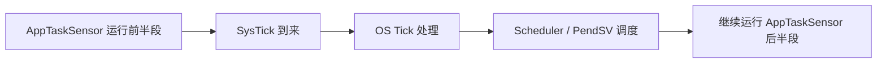

# SystemView 中 AppTaskSensor 的两种表现

本文简单说明：为什么在 `SystemView` 里，`AppTaskSensor` 有时看起来是一整段，有时又会被切成两小段。

## 1. 先说结论

`AppTaskSensor` 不是变成了两个任务，而是同一个任务在不同时间点被观察到的两种执行形态：

- 形态 1：连续运行，看起来像一整段
- 形态 2：运行到一半被 `SysTick` / 调度打断，看起来像两小段

本质上，任务始终只有一个。

## 2. 代码里它在做什么

`AppTaskSensor` 的主体逻辑在 [main.c](file:///d:/github/Quadcopter_2/Src/main.c#L117-L125)：

```c
static void AppTaskSensor(void *p_arg)
{
    (void)p_arg;

    while (1) {
        ReadPeripherals_Process();
        OSTimeDlyHMSM(0, 0, 0, 5);
    }
}
```

这说明它每一轮都会经历两个阶段：

1. 执行 `ReadPeripherals_Process()`
2. 调用 `OSTimeDlyHMSM(0, 0, 0, 5)`，阻塞 5ms

所以它天然不是“永远连续运行”的，而是周期性地：

- 运行
- 阻塞
- 到点唤醒
- 再运行

## 3. 为什么会看到一整段

如果 `AppTaskSensor` 被唤醒后，刚好这一小段时间内没有被 `SysTick` 打断，也没有更高优先级任务抢占，那么它在 `SystemView` 里就会显示成一整段连续的绿色条。

这通常表示：

- 它拿到 CPU 后比较顺畅地跑完了当前这一小段工作

## 4. 为什么会看到两小段

如果 `AppTaskSensor` 运行过程中，刚好遇到 `SysTick` 到来，那么执行过程会被切开。

典型过程如下：



于是，在 `SystemView` 上就会看到：

- 前半段 `AppTaskSensor`
- 中间一段 `SysTick`
- 可能还有一小段 `Scheduler` / `PendSV`
- 然后又回到 `AppTaskSensor`

这时你就会觉得它像“两种情况”，其实只是同一次运行被中断切成了两段。

## 5. 为什么这个任务特别容易这样

当前系统 tick 是 `1ms`，见 [os_cfg.h](file:///d:/github/Quadcopter_2/Config/os_cfg.h#L54-L54)。

而 `AppTaskSensor` 每次运行完后会延时 `5ms`，所以它会频繁经历：

- 被 tick 唤醒
- 运行一小段
- 再延时

因此它很容易和 `SysTick`、`PendSV`、`Scheduler` 出现在同一片时间区域里。

## 6. 怎么读图

看到 `AppTaskSensor` 时，可以这样理解：

- 一整段：这次运行比较顺，没有在你当前放大的时间窗里被切开
- 两小段：中间插进来了 `SysTick` 或调度过程
- 整段消失：它正在 `OSTimeDlyHMSM(5ms)`，处于阻塞态

## 7. 一句话总结

`SystemView` 里 `AppTaskSensor` 的“两种表现”，本质上不是任务变了，而是：

- 有时它完整跑完一小段
- 有时它在运行过程中被 `SysTick` / 调度打断

所以看起来不一样，但底层仍然是同一个周期任务。
