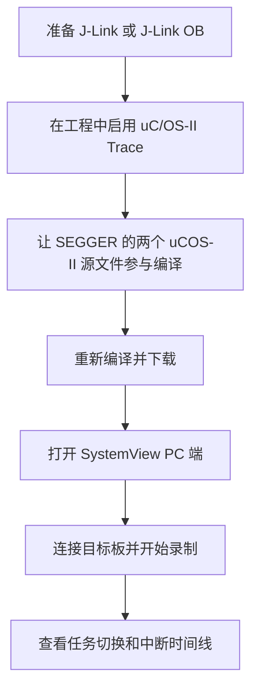
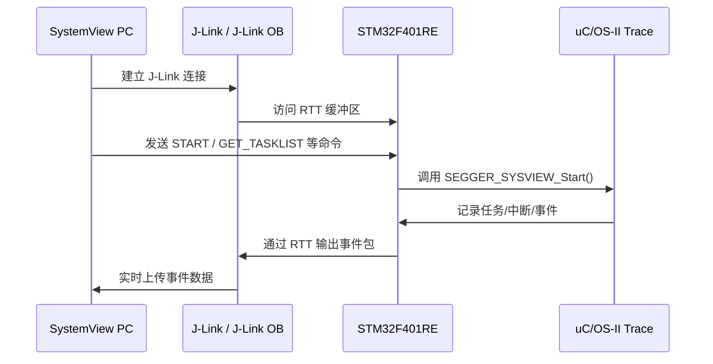
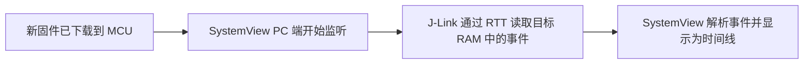

# SystemView 使用说明

本文面向当前 `Quadcopter_2` 工程，说明如何在 `STM32F401RE + uC/OS-II + Keil MDK` 环境下使用 `SEGGER SystemView` 观察任务切换、中断和内核事件。

## 1. 先说结论

当前工程里已经放入了 `SEGGER RTT` 和 `SystemView` 相关源码，也已经把相关头文件路径加入了 `Keil` 工程，但是 **还没有真正启用**。

当前状态如下：

- `Config/os_cfg.h` 中 `OS_TRACE_EN` 仍然是 `0`
- `LED.uvprojx` 中 `SEGGER_SYSVIEW_Config_Quadcopter.c` 和 `SEGGER_SYSVIEW_uCOSII.c` 目前仍是非编译文件
- 因此即使直接打开 PC 端 `SystemView`，当前固件也不会输出完整的 uC/OS-II 追踪事件

所以，正确使用 `SystemView` 的流程不是“直接打开软件”，而是：



## 2. 硬件和软件前提

### 2.1 硬件要求

SystemView 依赖 `SEGGER RTT` 传输数据，因此调试探针必须是 `SEGGER J-Link` 体系：

- 外接 `J-Link`
- 或者把 Nucleo 板载 `ST-LINK` 改刷为 `J-Link OB`

如果仍然使用原生 `ST-LINK`，通常不能直接使用 `SystemView` 的 `J-Link RTT` 通道。

如果你要把板载 `ST-LINK` 改成 `J-Link OB`，可参考：

- [Nucleo_Upper_Half.md](file:///d:/github/Quadcopter_2/Hardware/Nucleo_Upper_Half.md)

### 2.2 PC 端软件

需要准备：

- `Keil MDK`
- `SEGGER J-Link Software and Documentation Pack`
- `SEGGER SystemView` PC 软件

### 2.3 目标板

本项目目标器件为：

- `STM32F401RE`
- 工程文件：`LED.uvprojx`

## 3. 当前工程里哪些东西已经准备好了

### 3.1 SEGGER 目录已经存在

工程中已经包含：

- `SEGGER/RTT/SEGGER_RTT.c`
- `SEGGER/RTT/SEGGER_RTT_printf.c`
- `SEGGER/SystemView/SEGGER_SYSVIEW.c`
- `SEGGER/uCOS-II/SEGGER_SYSVIEW_Config_Quadcopter.c`
- `SEGGER/uCOS-II/SEGGER_SYSVIEW_uCOSII.c`
- `SEGGER/uCOS-II/os_trace_events.h`
- `SEGGER/uCOS-II/os_cfg_trace.h`

### 3.2 Include 路径已经加入

`LED.uvprojx` 中已经包含这些路径：

- `.\SEGGER\RTT`
- `.\SEGGER\SystemView`
- `.\SEGGER\Config`
- `.\SEGGER\uCOS-II`

这意味着头文件搜索路径基本已经准备好。

### 3.3 uC/OS-II 的 Trace 框架也已经接好了

`Source/os_trace.h` 中可以看到，只要 `OS_TRACE_EN > 0`，就会自动包含 `os_trace_events.h`：

- [os_trace.h](file:///d:/github/Quadcopter_2/Source/os_trace.h)

而 `SEGGER/uCOS-II/os_trace_events.h` 中已经把 uC/OS-II 的 Trace 宏映射到了 `SEGGER_SYSVIEW_*` API：

- `OS_TRACE_INIT() -> SEGGER_SYSVIEW_Conf()`
- `OS_TRACE_START() -> SEGGER_SYSVIEW_Start()`
- `OS_TRACE_ISR_ENTER() -> SEGGER_SYSVIEW_RecordEnterISR()`

所以，工程结构上已经具备启用条件。

## 4. 当前工程里还差哪几步

### 4.1 打开 uC/OS-II Trace

当前 `Config/os_cfg.h` 里的配置是：

```c
#define OS_TRACE_EN               0u
#define OS_TRACE_API_ENTER_EN     0u
#define OS_TRACE_API_EXIT_EN      0u
```

至少需要改成：

```c
#define OS_TRACE_EN               1u
#define OS_TRACE_API_ENTER_EN     0u
#define OS_TRACE_API_EXIT_EN      0u
```

说明：

- `OS_TRACE_EN = 1` 是必须项
- `API_ENTER/EXIT` 先保持 `0` 更稳妥，事件量不会太大
- 等基础追踪稳定后，再考虑打开更细粒度的 API 事件

### 4.2 让 uCOS-II 适配层参与编译

虽然 `LED.uvprojx` 中已经列出了这两个文件：

- `SEGGER/uCOS-II/SEGGER_SYSVIEW_Config_Quadcopter.c`
- `SEGGER/uCOS-II/SEGGER_SYSVIEW_uCOSII.c`

但它们当前在工程里是 **非编译文件**。  
如果保持现状，编译结果里不会真正包含 `SystemView` 的 uC/OS-II 适配逻辑。

建议做法：

1. 在 `Keil` 中把这两个文件从当前分组中删除
2. 重新用 `Add Existing Files to Group` 的方式把它们作为 `.c` 源文件加入工程
3. 确保它们显示为可编译的 C Source，而不是普通文档/头文件

如果你熟悉工程文件，也可以直接修改 `LED.uvprojx`，但更推荐在 `Keil` 图形界面里操作。

### 4.3 保留或检查配置文件

以下两个文件当前是空配置壳，通常可以先保持不改：

- `SEGGER/Config/SEGGER_SYSVIEW_Conf.h`
- `SEGGER/Config/SEGGER_RTT_Conf.h`

当前项目的主要板级配置已经写在：

- [SEGGER_SYSVIEW_Config_Quadcopter.c](file:///d:/github/Quadcopter_2/SEGGER/uCOS-II/SEGGER_SYSVIEW_Config_Quadcopter.c)

里面已经设置了：

- 应用名：`Quadcopter_uCOSII`
- 设备名：`STM32F401RETx`
- RAM Base：`0x20000000`
- 系统描述中的中断项：`SysTick`、`TIM2`、`TIM4`

### 4.4 下载方式必须是 J-Link

要使用 `SystemView`，调试器应配置为：

- `J-LINK / J-Trace Cortex`
- 接口选择 `SWD`

如果你已经把板载 `ST-LINK` 改刷成 `J-Link OB`，也按 `J-Link` 使用即可。

## 5. 在 Keil 中如何启用

### Step 1：修改 `os_cfg.h`

打开：

- [os_cfg.h](file:///d:/github/Quadcopter_2/Config/os_cfg.h)

把：

```c
#define OS_TRACE_EN               0u
```

改成：

```c
#define OS_TRACE_EN               1u
```

### Step 2：让两个 `.c` 文件参与编译

确认以下文件以“可编译源文件”形式存在于工程中：

- `SEGGER/uCOS-II/SEGGER_SYSVIEW_Config_Quadcopter.c`
- `SEGGER/uCOS-II/SEGGER_SYSVIEW_uCOSII.c`

### Step 3：重新编译工程

编译前建议确认没有以下问题：

- 找不到 `SEGGER_SYSVIEW.h`
- 找不到 `os_trace_events.h`
- 重复定义的 `SEGGER` 符号

### Step 4：切换调试器

在 `Options for Target` 中：

1. `Debug` 页选择 `J-LINK / J-Trace Cortex`
2. `Settings` 中把接口选成 `SWD`
3. `Utilities` 页中也切换到 J-Link 对应下载器
4. 目标器件仍是 `STM32F401RE`

### Step 5：下载到开发板

重新下载程序到板子，保证当前运行的固件是带 `SystemView` 支持的新版本。

## 6. PC 端如何使用 SystemView

### Step 1：打开 SystemView

启动 `SEGGER SystemView` PC 软件。

### Step 2：配置 Recorder

在 `Target -> Recorder Configuration` 中填写：

- `Recorder`：`SEGGER J-Link`
- `Target Device`：`STM32F401RE`
- `Target Interface`：`SWD`
- `Speed`：先用 `Auto`，不稳定时可改为 `4000 kHz`

### Step 3：开始录制

点击开始录制后，`SystemView` 会通过 `J-Link RTT` 与目标板通信：



### Step 3.1：把 `D -> E -> F -> G` 这三步彻底拆开理解

前面流程图中的：

- `D[重新编译并下载]`
- `E[打开 SystemView PC 端]`
- `F[连接目标板并开始录制]`
- `G[查看任务切换和中断时间线]`

看起来像是几句很简单的话，但它们背后其实对应了完整的一条“板端产生日志 -> 调试器搬运数据 -> PC 端还原时序”的链路。

可以把这几步理解成：



#### `D -> E`：打开 `SystemView PC` 端，到底是在做什么

这一步的前提是：

- 你已经在 `Keil` 里重新编译成功
- 新固件已经下载到板子
- 新固件中确实包含了 `SystemView` 和 `uC/OS-II trace` 相关代码

也就是说，`E` 不是“从零开始启用追踪”，而是“PC 端开始准备接收已经能够输出的追踪数据”。

对当前工程来说，固件端的初始化链路如下：

- `OS_TRACE_INIT() -> SEGGER_SYSVIEW_Conf()`
- `OS_TRACE_START() -> SEGGER_SYSVIEW_Start()`

对应文件：

- [os_trace_events.h](file:///d:/github/Quadcopter_2/SEGGER/uCOS-II/os_trace_events.h)
- [SEGGER_SYSVIEW_Config_Quadcopter.c](file:///d:/github/Quadcopter_2/SEGGER/uCOS-II/SEGGER_SYSVIEW_Config_Quadcopter.c)

这说明只要 `OS_TRACE_EN = 1` 且相关 `.c` 文件参与了编译，板子运行起来后，内核事件就已经具备“被采集”的条件。

你在电脑上的实际操作非常简单：

1. 插好开发板
2. 确认电脑识别的是 `J-Link` 或 `J-Link OB`
3. 关闭可能占用调试器的 `Keil Debug` 会话
4. 启动 `SEGGER SystemView`

此时 `SystemView` 只是一个“监听器”，它还没有真正拿到目标板的数据。

#### `E -> F`：连接目标板并开始录制，底层到底发生了什么

这一步是真正建立“PC 端 <- J-Link <- MCU”数据通路的过程。

从机制上看，事情分成 4 层：

1. `uC/OS-II` 内核在运行过程中触发 trace 宏
2. 这些 trace 宏调用 `SEGGER_SYSVIEW_*` 接口，把事件写入 `RTT` 缓冲区
3. `J-Link` 通过 `SWD` 访问目标板 RAM，读取 `RTT` 数据
4. `SystemView PC` 端把这些原始事件还原成可视化的任务/中断时间线

其中，第 2 层是最关键的。如果 trace 宏没有真正启用，那么你可能“能连上 J-Link”，但窗口里什么都没有。

因此，`F` 这一步并不只是“点一下开始按钮”，它的本质是：

- 验证 RTT 通道是否正常
- 验证固件是否真的在输出事件
- 验证 PC 端是否能正确识别目标器件和接口

在 `SystemView` 中，推荐你这样配置：

- `Recorder`: `SEGGER J-Link`
- `Target Device`: `STM32F401RE`
- `Target Interface`: `SWD`
- `Speed`: 先选 `Auto`

如果 `Auto` 不稳定，再改成：

- `4000 kHz`

点击开始录制之后，理想状态下会发生这些现象：

- 状态栏显示连接成功
- 事件计数开始增长
- 时间轴开始刷新
- `Timeline` 和 `Events` 窗口逐渐出现系统活动

如果点击录制后没有任何变化，通常要优先怀疑下面几件事：

- `Keil` 还在占用调试器
- 当前下载到板子里的不是最新固件
- `OS_TRACE_EN` 没有真正打开
- `SEGGER_SYSVIEW_uCOSII.c` 没参与编译
- 目标接口选错，不是 `SWD`
- 目标器件填错，不是 `STM32F401RE`

#### `F -> G`：为什么一连接上，就能看到任务切换和中断时间线

因为 `SystemView` 并不是在看“打印字符串”，它看的是真实的内核事件流。

例如当前工程里：

- 任务创建会映射到 `SEGGER_SYSVIEW_OnTaskCreate()`
- 任务切入会映射到 `SEGGER_SYSVIEW_OnTaskStartExec()`
- ISR 进入会映射到 `SEGGER_SYSVIEW_RecordEnterISR()`

这些映射关系在：

- [os_trace_events.h](file:///d:/github/Quadcopter_2/SEGGER/uCOS-II/os_trace_events.h)
- [SEGGER_SYSVIEW_uCOSII.c](file:///d:/github/Quadcopter_2/SEGGER/uCOS-II/SEGGER_SYSVIEW_uCOSII.c)

因此，时间线窗口里每一段彩色条带，本质上都对应了一个真实发生过的内核动作，而不是软件随便画出来的“示意图”。

你在 `Timeline` 里应该重点观察 3 类信息：

- 当前 CPU 正在执行哪个任务
- 某次中断打断了哪个任务，以及持续了多久
- 中断退出后是否触发了任务切换

对于你这个四旋翼项目，最值得先看的不是“所有事件”，而是下面这些基础行为：

- `SysTick` 是否稳定地每 `1ms` 出现一次
- `Idle Task` 是否长期占满 CPU
- 启动任务是否在完成初始化后进入阻塞
- 周期任务是否按预期频率被唤醒
- 某个外设中断是否异常频繁或执行过长

#### 这三步对应的人话解释

- `打开 SystemView PC 端`：让 PC 软件进入监听状态
- `连接目标板并开始录制`：通过 `J-Link RTT` 真正把板子里的事件抓上来
- `查看任务切换和中断时间线`：把抓到的事件还原成“谁在运行、谁被打断、什么时候切换”的时序图

#### 实际操作时的推荐顺序

建议每次都按这个顺序来，最不容易踩坑：

1. 在 `Keil` 中确认工程编译通过
2. 把最新固件下载到开发板
3. 让板子正常复位并运行
4. 退出 `Keil` 的调试占用状态
5. 打开 `SystemView`
6. 配置 `J-Link`、`SWD`、`STM32F401RE`
7. 点击开始录制
8. 先观察 `SysTick`、`Idle Task`、启动任务
9. 确认基础链路正常后，再分析具体任务和外设中断

如果你发现“能连接但没有事件”，不要先怀疑 `SystemView` 软件本身，优先回头检查：

- `OS_TRACE_EN`
- `SEGGER_SYSVIEW_Config_Quadcopter.c`
- `SEGGER_SYSVIEW_uCOSII.c`
- 下载到板子上的是否真的是最新编译结果


### Step 4：观察内容


- `Timeline`
- `Events`
- `CPU Load`
- `Terminal` 或资源列表

重点关注：

- 任务切换是否符合优先级预期
- `SysTick` 周期是否稳定
- 某个任务是否长时间占用 CPU
- 中断是否抢占过于频繁
- `Idle Task` 占比是否合理

## 7. 对你这个项目最有价值的观察点

对于当前四旋翼项目，最有价值的不是“看所有事件”，而是先看这几类：

### 7.1 任务切换

重点看：

- `AppTaskStart`
- `AppTaskSensor`
- `AppTaskDebug`
- `Idle Task`
- `Stat Task`

这样可以直观看到：

- 启动任务是否完成后进入周期性阻塞
- 传感器任务是否按预期每 `5ms` 运行一次
- 调试任务是否每 `1s` 醒来一次

### 7.2 SysTick 与调度

当前系统节拍为：

- `OS_TICKS_PER_SEC = 1000`

所以理论上 `SysTick` 每 `1ms` 触发一次。  
你可以重点观察：

- Tick 是否稳定
- Tick 后是否经常触发任务切换
- 是否有异常长延迟

### 7.3 中断与任务关系

如果后续把外设中断事件也纳入观察，你可以分析：

- 中断进来以后多久引起调度
- 中断退出后是否切换到更高优先级任务
- 某些外设中断是否过密，影响任务稳定性

## 8. 常见问题排查

### 8.1 SystemView 能连上 J-Link，但没有任何事件

优先检查：

- `OS_TRACE_EN` 是否仍然是 `0`
- `SEGGER_SYSVIEW_uCOSII.c` 是否真的参与了编译
- 当前下载到板上的是否是最新固件

### 8.2 编译通过，但只看到很少的系统信息

通常说明：

- `SEGGER_SYSVIEW_Config_Quadcopter.c` 参与编译了
- 但 `uCOS-II` 的 trace 宏没有真正启用

最先检查 `os_cfg.h` 里的 `OS_TRACE_EN`。

### 8.3 PC 端连接超时

优先检查：

- 是否真的使用了 `J-Link` 或 `J-Link OB`
- `SWD` 接口是否选对
- 目标器件是否填成 `STM32F401RE`
- 调试器是否已被 `Keil` 占用

### 8.4 RTT 不稳定或掉包

可尝试：

- 把连接速度从 `Auto` 改为 `4000 kHz`
- 减少事件量，先保持 `OS_TRACE_API_ENTER_EN = 0`
- 先只观察任务切换，不急着开大量自定义事件

## 9. 建议的最小启用方案

如果你只想先尽快跑起来，建议按下面的“最小变更”启用：

1. 把 `OS_TRACE_EN` 改为 `1`
2. 让 `SEGGER_SYSVIEW_Config_Quadcopter.c` 和 `SEGGER_SYSVIEW_uCOSII.c` 参与编译
3. 使用 `J-Link` 或 `J-Link OB`
4. 重新下载程序
5. 用 `SystemView` 观察任务切换和 `SysTick`

先确认这 5 步跑通，再考虑：

- 打开更多 API 级事件
- 添加用户自定义事件
- 接入更多 ISR 追踪点

## 10. 相关文件速查

- 工程文件：[LED.uvprojx](file:///d:/github/Quadcopter_2/LED.uvprojx)
- OS 配置：[os_cfg.h](file:///d:/github/Quadcopter_2/Config/os_cfg.h)
- Trace 总入口：[os_trace.h](file:///d:/github/Quadcopter_2/Source/os_trace.h)
- uC/OS-II 到 SystemView 的映射：[os_trace_events.h](file:///d:/github/Quadcopter_2/SEGGER/uCOS-II/os_trace_events.h)
- SystemView 板级配置：[SEGGER_SYSVIEW_Config_Quadcopter.c](file:///d:/github/Quadcopter_2/SEGGER/uCOS-II/SEGGER_SYSVIEW_Config_Quadcopter.c)
- uC/OS-II 适配实现：[SEGGER_SYSVIEW_uCOSII.c](file:///d:/github/Quadcopter_2/SEGGER/uCOS-II/SEGGER_SYSVIEW_uCOSII.c)
- 上半部分调试器说明：[Nucleo_Upper_Half.md](file:///d:/github/Quadcopter_2/Hardware/Nucleo_Upper_Half.md)
