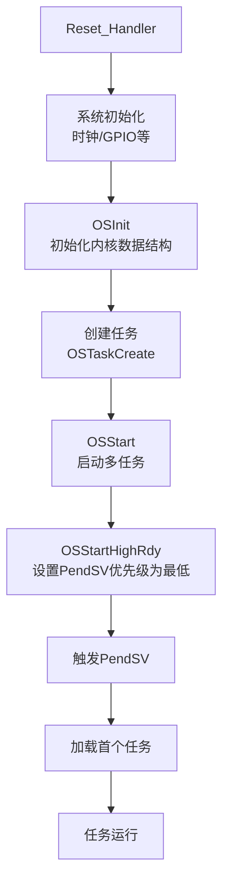
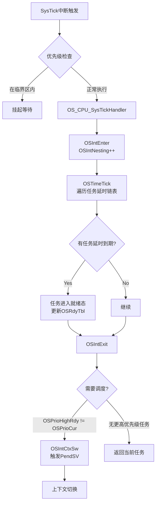
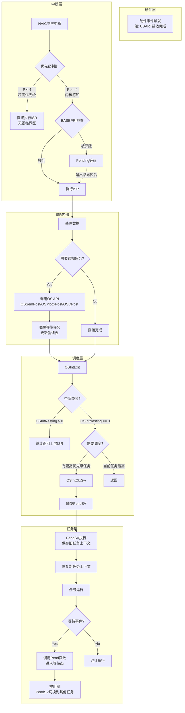
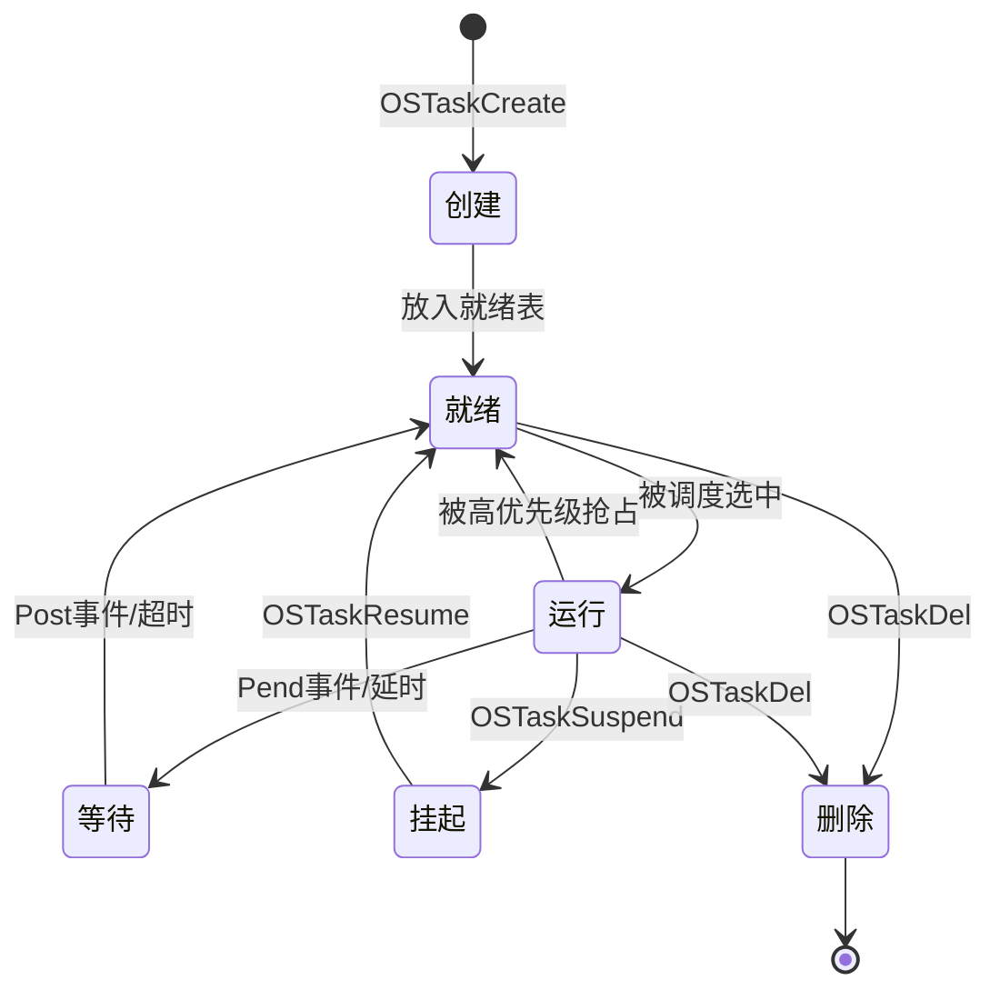

# STM32 事件触发机制详解（结合 uC/OS-II）

本文档详细讲解 STM32F4 系列微控制器的事件触发机制，包括 NVIC 中断配置、uC/OS-II 中的优先级配置，以及任务调度与上下文切换的完整流程。

---

## 目录

1. [硬件底层：NVIC 与中断优先级](#1-硬件底层nvic-与中断优先级)
2. [中断配置实战](#2-中断配置实战)
3. [uC/OS-II 优先级体系](#3-ucos-ii-优先级体系)
4. [事件触发与任务调度](#4-事件触发与任务调度)
5. [上下文切换详解](#5-上下文切换详解)
6. [完整流程图](#6-完整流程图)

---

## 1. 硬件底层：NVIC 与中断优先级

### 1.1 NVIC 架构概览

**NVIC (Nested Vectored Interrupt Controller)** 是 ARM Cortex-M 系列内核内置的嵌套向量中断控制器，它提供了：
- **自动中断嵌套**：高优先级中断可以打断低优先级中断
- **向量表机制**：中断服务函数入口地址直接存储在向量表中
- **尾链优化 (Tail-Chaining)**：连续中断无需完整保存/恢复上下文
- **晚到优先级 (Late-Arriving)**：更高级中断可在当前中断入栈阶段抢占

### 1.2 STM32 的优先级位宽

ARM Cortex-M 规范定义优先级为 **8 位寄存器**，理论支持 256 个优先级。但 STM32F4 为了节省成本，**只使用高 4 位**：

```
┌───────────────────────────────────────────────┐
│ 优先级寄存器 (8位)                               │
├─────┬─────┬─────┬─────┬─────┬─────┬─────┬─────┤
│ Bit7│ Bit6│ Bit5│ Bit4│ Bit3│ Bit2│ Bit1│ Bit0│
├─────┴─────┴─────┴─────┼─────┴─────┴─────┴─────┤
│    有效优先级位 (4位)   │    固定为 0 (4位)       │
│    CPU_CFG_NVIC_PRIO_BITS = 4                 │
└───────────────────────────────────────────────┘
```

**核心原则**：
- 有效优先级数量 = $2^4 = 16$ 个
- 范围：**0 ~ 15**（数字越小，优先级越高）
- **优先级 0 是最高优先级，15 是最低优先级**

### 1.3 抢占优先级 vs 响应优先级

STM32 官方库将 4 位优先级划分为两部分：

| 类型 | 作用 | 特性 |
|------|------|------|
| **抢占优先级 (Preemption Priority)** | 决定能否打断正在执行的中断 | 可嵌套抢占 |
| **响应优先级 (Sub Priority)** | 决定同时发生时的执行顺序 | 不能打断，只排队 |

**优先级分组配置**（通过 `NVIC_PriorityGroupConfig()`）：

| 分组 | 抢占位数 | 响应位数 | 抢占范围 | 响应范围 |
|------|----------|----------|----------|----------|
| Group 0 | 0 bit | 4 bits | 仅 0 | 0~15 |
| Group 1 | 1 bit | 3 bits | 0~1 | 0~7 |
| Group 2 | 2 bits | 2 bits | 0~3 | 0~3 |
| Group 3 | 3 bits | 1 bit | 0~7 | 0~1 |
| **Group 4** | 4 bits | 0 bit | **0~15** | 仅 0 |

> **最佳实践**：在 uC/OS-II 中，推荐使用 **Group 4**（全抢占模式），逻辑最清晰。

---

## 2. 中断配置实战

### 2.1 NVIC 初始化标准流程

```c
// 1. 配置优先级分组（通常在系统初始化时调用一次）
NVIC_PriorityGroupConfig(NVIC_PriorityGroup_4);

// 2. 配置具体中断通道
NVIC_InitTypeDef NVIC_InitStruct;
NVIC_InitStruct.NVIC_IRQChannel = EXTI0_IRQn;          // 中断通道
NVIC_InitStruct.NVIC_IRQChannelPreemptionPriority = 5; // 抢占优先级
NVIC_InitStruct.NVIC_IRQChannelSubPriority = 0;        // 响应优先级
NVIC_InitStruct.NVIC_IRQChannelCmd = ENABLE;           // 使能中断
NVIC_Init(&NVIC_InitStruct);
```

### 2.2 EXTI（外部中断）配置示例

```c
// 1. 使能 SYSCFG 和 GPIO 时钟
RCC_APB2PeriphClockCmd(RCC_APB2Periph_SYSCFG, ENABLE);
RCC_AHB1PeriphClockCmd(RCC_AHB1Periph_GPIOA, ENABLE);

// 2. 配置 GPIO 为输入模式
GPIO_InitTypeDef GPIO_InitStruct;
GPIO_InitStruct.GPIO_Pin = GPIO_Pin_0;
GPIO_InitStruct.GPIO_Mode = GPIO_Mode_IN;
GPIO_InitStruct.GPIO_PuPd = GPIO_PuPd_UP;  // 上拉
GPIO_Init(GPIOA, &GPIO_InitStruct);

// 3. 将 GPIO 连接到 EXTI 线
SYSCFG_EXTILineConfig(EXTI_PortSourceGPIOA, EXTI_PinSource0);

// 4. 配置 EXTI 线
EXTI_InitTypeDef EXTI_InitStruct;
EXTI_InitStruct.EXTI_Line = EXTI_Line0;
EXTI_InitStruct.EXTI_Mode = EXTI_Mode_Interrupt;
EXTI_InitStruct.EXTI_Trigger = EXTI_Trigger_Falling; // 下降沿触发
EXTI_InitStruct.EXTI_LineCmd = ENABLE;
EXTI_Init(&EXTI_InitStruct);

// 5. 配置 NVIC（见上文）
```

### 2.3 中断服务函数模板

```c
// stm32f4xx_it.c 中定义
void EXTI0_IRQHandler(void)
{
    // 清除中断标志
    if (EXTI_GetITStatus(EXTI_Line0) != RESET) {
        EXTI_ClearITPendingBit(EXTI_Line0);
        
        // 中断处理逻辑
        // ...
    }
}
```

---

## 3. uC/OS-II 优先级体系

### 3.1 双重优先级概念

uC/OS-II 涉及两种完全不同的优先级体系：

| 体系 | 范围 | 含义 | 备注 |
|------|------|------|------|
| **任务优先级** | 0~63（或更多） | 调度优先级 | **数值越小优先级越高** |
| **硬件中断优先级** | 0~15 | NVIC 优先级 | **数值越小优先级越高** |

> 两个体系的数值含义一致，但作用域不同！

### 3.2 内核感知边界 (KA_IPL_BOUNDARY)

uC/OS-II 将中断划分为两大阵营，边界由 `CPU_CFG_KA_IPL_BOUNDARY` 定义（通常为 **4**）：

```
┌─────────────────────────────────────────────────────────────┐
│                    STM32 NVIC 优先级体系                      │
├─────────────────────┬───────────────────────────────────────┤
│ 优先级 0 ~ 3         │ 优先级 4 ~ 15                          │
│ (超高优先级中断)      │ (内核感知中断)                          │
├─────────────────────┼───────────────────────────────────────┤
│ • 不受 OS 管控       │ • 受 OS 临界区控制                      │
│ • 可随时抢占          │ • BASEPRI 屏蔽机制                     │
│ • 禁止调用 OS API    │ • 可以安全调用 OS API                   │
│                     │ • SysTick = 优先级 4                   │
│                     │ • PendSV = 优先级 15 (最低)             │
└─────────────────────┴───────────────────────────────────────┘
                         ↑
                  KA_IPL_BOUNDARY = 4
```

### 3.3 BASEPRI 临界区机制

**BASEPRI** 是 Cortex-M 的特殊寄存器，用于屏蔽指定优先级及以下的中断：

```c
// 进入临界区（屏蔽优先级 4~15 的中断）
OS_ENTER_CRITICAL();
    // 此时 BASEPRI = 4 << (8-4) = 64
    // 只有优先级 0~3 的中断可以执行
OS_EXIT_CRITICAL();
    // BASEPRI = 0，恢复所有中断
```

关键代码（来自 `os_cpu_a.asm`）：

```asm
OS_CPU_SR_Save
    CPSID   I                   ; 关闭全局中断
    MRS     R1, BASEPRI         ; 读取当前 BASEPRI
    MSR     BASEPRI, R0         ; 设置新的屏蔽阈值
    DSB
    ISB                         ; 同步指令流水线
    MOV     R0, R1              ; 返回旧值用于恢复
    CPSIE   I                   ; 开启全局中断
    BX      LR
```

### 3.4 任务优先级配置示例

```c
// app_cfg.h 中定义任务优先级
#define APP_CFG_STARTUP_TASK_PRIO    2    // 启动任务优先级
#define APP_CFG_LED_TASK_PRIO        5    // LED 任务优先级
#define APP_CFG_SENSOR_TASK_PRIO     3    // 传感器任务优先级
#define APP_CFG_MOTOR_TASK_PRIO      4    // 电机控制任务优先级

// 创建任务
OSTaskCreate(
    AppTaskStart,
    (void *)0,
    &AppTaskStartStk[APP_CFG_STARTUP_TASK_STK_SIZE - 1],
    APP_CFG_STARTUP_TASK_PRIO    // 优先级越小越重要
);
```

---

## 4. 事件触发与任务调度

### 4.1 事件触发路径

事件触发有两种主要路径：

**路径 A：中断触发任务**


**路径 B：任务间同步**


### 4.2 关键 OS 函数

| 函数 | 调用时机 | 作用 |
|------|----------|------|
| `OSIntEnter()` | ISR 开始时 | 增加中断嵌套计数 `OSIntNesting++` |
| `OSIntExit()` | ISR 结束时 | 减少嵌套计数，触发调度 |
| `OSSched()` | 任务级 | 任务级调度入口 |
| `OSIntCtxSw()` | 中断级 | 触发 PendSV（中断上下文） |
| `OSCtxSw()` | 任务级 | 触发 PendSV（任务上下文） |

### 4.3 ISR 与任务通信示例

```c
// 定时器中断 - 采集传感器数据
void TIM2_IRQHandler(void)
{
    if (TIM_GetITStatus(TIM2, TIM_IT_Update) != RESET) {
        TIM_ClearITPendingBit(TIM2, TIM_IT_Update);
        
        // 采集数据
        sensor_data = ReadSensor();
        
        // 发送到消息队列（唤醒处理任务）
        OSQPost(sensor_queue, (void *)&sensor_data);
        
        // 不需要手动调用 OSIntEnter/OSIntExit
        // 因为已经在 OS_CPU_SysTickHandler 模板中处理
    }
}

// 传感器数据处理任务
void SensorTask(void *p_arg)
{
    void *msg;
    INT8U err;
    
    while (1) {
        // 等待消息（阻塞状态）
        msg = OSQPend(sensor_queue, 0, &err);
        
        // 处理数据
        ProcessSensorData(msg);
    }
}
```

---

## 5. 上下文切换详解

### 5.1 PendSV 的核心作用

**PendSV (Pendable Service Call)** 是 ARM Cortex-M 的特殊异常，专门用于 RTOS 上下文切换：

1. **最低优先级**（优先级 15）—— 确保在其他中断完成后执行
2. **延迟执行** —— 可以被"挂起"，等待时机成熟
3. **安全切换** —— 此时无其他中断活跃，上下文完整

### 5.2 触发 PendSV 的代码

```asm
; os_cpu_a.asm
OSCtxSw
OSIntCtxSw
    LDR     R0, =NVIC_INT_CTRL      ; 中断控制寄存器地址 0xE000ED04
    LDR     R1, =NVIC_PENDSVSET     ; PendSV 挂起位 0x10000000
    STR     R1, [R0]                ; 写入寄存器，触发 PendSV
    BX      LR                      ; 返回
```

### 5.3 PendSV 处理流程（完整汇编解析）

```asm
OS_CPU_PendSVHandler
    ; 1. 设置 BASEPRI（进入 OS 管控区）
    CPSID   I
    MOV32   R2, OS_KA_BASEPRI_Boundary
    LDR     R1, [R2]
    MSR     BASEPRI, R1
    DSB
    ISB
    CPSIE   I

    ; 2. 保存当前任务上下文
    MRS     R0, PSP                 ; 获取进程栈指针
    STMFD   R0!, {R4-R11, R14}      ; 保存 R4-R11, LR 到栈
    
    ; 3. 更新当前任务 TCB 的栈指针
    LDR     R5, =OSTCBCur
    LDR     R1, [R5]                ; R1 = OSTCBCur
    STR     R0, [R1]                ; OSTCBCur->OSTCBStkPtr = PSP
    
    ; 4. 调用任务切换钩子函数
    MOV     R4, LR                  ; 保存 exc_return
    BL      OSTaskSwHook            ; 用户可在此添加调试代码
    
    ; 5. 找到最高优先级就绪任务
    LDR     R0, =OSPrioCur
    LDR     R1, =OSPrioHighRdy
    LDRB    R2, [R1]
    STRB    R2, [R0]                ; OSPrioCur = OSPrioHighRdy
    
    LDR     R1, =OSTCBHighRdy
    LDR     R2, [R1]
    STR     R2, [R5]                ; OSTCBCur = OSTCBHighRdy
    
    ; 6. 恢复新任务上下文
    ORR     LR, R4, #0x04           ; 确保返回使用 PSP
    LDR     R0, [R2]                ; R0 = 新任务的栈指针
    LDMFD   R0!, {R4-R11, R14}      ; 恢复 R4-R11, LR
    MSR     PSP, R0                 ; 更新 PSP
    
    ; 7. 恢复 BASEPRI 并返回
    MOV32   R2, #0
    CPSID   I
    MSR     BASEPRI, R2             ; 恢复为 0
    DSB
    ISB
    CPSIE   I
    BX      LR                      ; 异常返回，自动恢复 R0-R3, R12, PC, xPSR
```

### 5.4 任务栈帧结构

PendSV 入口时，硬件已自动保存以下寄存器（栈顶向下生长）：

```
┌─────────────┬──────────────────────────────────────┐
│ 堆栈偏移     │ 内容                                  │
├─────────────┼──────────────────────────────────────┤
│ PSP + 0     │ xPSR（程序状态寄存器）                  │
│ PSP + 4     │ PC（返回地址/任务入口点）               │
│ PSP + 8     │ LR（链接寄存器 R14）                   │
│ PSP + 12    │ R12                                  │
│ PSP + 16    │ R3                                   │
│ PSP + 20    │ R2                                   │
│ PSP + 24    │ R1                                   │
│ PSP + 28    │ R0（任务参数 p_arg）                   │
├─────────────┼──────────────────────────────────────┤
│             │ ↑ 硬件自动保存                         │
├─────────────┼──────────────────────────────────────┤
│ PSP + 32    │ EXEC_RETURN（0xFFFFFFFD）             │
│ PSP + 36    │ R4                                   │
│ PSP + 40    │ R5                                   │
│ ...         │ R6-R11                               │
│ PSP + 64    │ R11                                  │
├─────────────┼──────────────────────────────────────┤
│             │ ↑ PendSV 手动保存                     │
└─────────────┴──────────────────────────────────────┘
```

---

## 6. 完整流程图

### 6.1 系统启动流程



### 6.2 SysTick 时钟滴答流程



### 6.3 中断与任务协作完整流程



### 6.4 任务状态转换图



---

## 7. 关键配置参数总结

| 参数 | 推荐值 | 说明 |
|------|--------|------|
| `NVIC_PriorityGroup` | Group 4 | 全抢占模式，逻辑清晰 |
| `CPU_CFG_KA_IPL_BOUNDARY` | 4 | 内核感知中断边界 |
| `CPU_CFG_NVIC_PRIO_BITS` | 4 | STM32F4 有效优先级位数 |
| `SysTick 优先级` | 4 | 边界值，可调用 OS API |
| `PendSV 优先级` | 15 (0xFF) | 最低优先级 |
| `OS_TICKS_PER_SEC` | 100~1000 | 时钟节拍频率 |

---

## 8. 常见问题与注意事项

### Q1: 为什么 SysTick 和 PendSV 的优先级差距这么大？

**答**：
- SysTick 需要及时执行以保证时间精度，设为边界值（4）属于内核感知中断
- PendSV 必须是最低优先级（15），确保在所有中断完成后执行，保证上下文完整

### Q2: 超高优先级中断（0~3）为什么不能调用 OS API？

**答**：
- 这些中断不受 OS 临界区保护，可能在 OS 操作内核数据结构时打断
- 如果此时调用 `OSSemPost` 等修改内核数据，会导致数据损坏或系统崩溃

### Q3: 如何实现"零延迟"紧急中断？

**答**：
```c
// 配置为优先级 0~3
NVIC_InitStruct.NVIC_IRQChannelPreemptionPriority = 2;  // 超高优先级

// ISR 中只做硬件操作，不调用任何 OS 函数
void EmergencyISR(void) {
    MotorEmergencyStop();  // 纯硬件操作
    // 不调用 OSSemPost 等
}
```

### Q4: FPU 浮点寄存器如何处理？

**答**：
当启用硬件 FPU 时，栈帧需要额外保存/恢复 S0-S31 和 FPSCR：

```asm
; os_cpu_c.c OSTaskStkInit() 中自动处理
#if (OS_CPU_ARM_FP_EN > 0u)
    *(--p_stk) = (OS_STK)0x02000000u;   ; FPSCR
    *(--p_stk) = (OS_STK)0x00000000u;   ; S0
    // ... S1-S15
#endif
```

---

## 附录：相关源码文件索引

| 文件 | 作用 | 位置 |
|------|------|------|
| `os_cpu_a.asm` | 汇编层上下文切换 | `ucOS2/Port/` |
| `os_cpu_c.c` | C 层移植代码、栈初始化 | `ucOS2/Port/` |
| `os_core.c` | 内核核心调度逻辑 | `ucOS2/Source/` |
| `stm32f4xx_it.c` | 中断服务函数模板 | `ucOS2/DRIVER/FWLib/` |
| `misc.c` | NVIC 配置函数 | `ucOS2/DRIVER/FWLib/src/` |
| `stm32f4xx_exti.c` | EXTI 驱动 | `ucOS2/DRIVER/FWLib/src/` |

---

## 参考资料

1. ARM Cortex-M4 Technical Reference Manual
2. STM32F4xx Reference Manual (RM0090)
3. uC/OS-II The Real-Time Kernel (Jean J. Labrosse)
4. 项目现有文档：`STM32_NVIC_Interrupt_Mechanism.md`, `PendSV.md`, `UCOS_II_Detail.md`