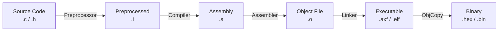

# STM32 程序编译流程详解

本文档详细讲解 STM32（Cortex-M）程序的完整编译流程。我们将从源代码（Source Code）出发，一步步解析它是如何变成最终可烧录的二进制文件（Binary/Hex）的。

## 1. 编译流程概览

一个 STM32 工程通常包含多个 `.c` 源文件、`.h` 头文件以及启动文件 `.s`。整个构建过程（Build Process）可以分为四个主要阶段：

1.  **预处理 (Preprocessing)**
2.  **编译 (Compilation)**
3.  **汇编 (Assembly)**
4.  **链接 (Linking)**

此外，通常还有一个额外的步骤：**格式转换**，用于生成烧录器可识别的文件格式。

---

## 2. 详细步骤解析

### 2.1 预处理 (Preprocessing)
*   **输入**：`.c` 源文件, `.h` 头文件
*   **工具**：预处理器 (cpp / arm-none-eabi-cpp)
*   **动作**：
    *   **展开宏定义**：将所有的 `#define` 替换为实际的值或代码片段。
    *   **处理条件编译**：根据 `#ifdef`, `#if`, `#endif` 等指令，保留或删除代码块。
    *   **包含头文件**：将 `#include "xxx.h"` 的内容直接复制粘贴到源文件中。
    *   **删除注释**：去掉所有的 `//` 和 `/* ... */`。
*   **输出**：`.i` 文件（纯粹的 C 代码，不包含任何预处理指令）。

### 2.2 编译 (Compilation)
*   **输入**：`.i` 预处理后的文件
*   **工具**：编译器 (cc1 / arm-none-eabi-gcc)
*   **动作**：
    *   **词法/语法分析**：检查代码是否有语法错误。
    *   **优化**：根据优化等级（-O0, -O1, -O2, -O3）优化代码逻辑。
    *   **翻译**：将 C 语言代码翻译成目标架构（ARM Cortex-M）的汇编指令。
*   **输出**：`.s` 汇编文件。

### 2.3 汇编 (Assembly)
*   **输入**：`.s` 汇编文件（包括编译器生成的和手写的启动文件 `startup_xxx.s`）
*   **工具**：汇编器 (as / arm-none-eabi-as)
*   **动作**：
    *   将汇编指令（如 `MOV R0, #1`）翻译成机器码（Machine Code，如 `0x2001`）。
    *   生成符号表（Symbol Table），记录函数和变量的名字，但此时还不知道它们的最终内存地址。
*   **输出**：`.o` 或 `.obj` 目标文件（Relocatable Object File）。

### 2.4 链接 (Linking)
这是最关键的一步，也是嵌入式开发中常遇到报错（如 `Undefined Reference`）的阶段。

*   **输入**：所有的 `.o` 目标文件 + 静态库文件 (`.a` / `.lib`)
*   **工具**：链接器 (ld / arm-none-eabi-ld / armlink)
*   **配置文件**：**链接脚本** (Linker Script)
    *   GCC: `.ld` 文件
    *   Keil: `.sct` (Scatter File)
*   **动作**：
    1.  **符号解析 (Symbol Resolution)**：将函数调用（如 `main` 调用 `SystemInit`）与对应的函数定义关联起来。如果找不到定义，就会报“未定义引用”错误。
    2.  **地址分配 (Address Binding)**：根据链接脚本中定义的内存布局（Flash 和 RAM 的起始地址及大小），为每个代码段（.text）和数据段（.data, .bss）分配实际的物理地址。
    3.  **重定位 (Relocation)**：修改代码中的占位符地址，填入最终分配的绝对地址。
*   **输出**：`.axf` (Keil) 或 `.elf` (GCC) 文件。这是包含调试信息和符号表的完整可执行文件。

---

## 3. 重要文件类型说明

### 3.1 映射文件 (.map)
链接器生成的 `.map` 文件是分析程序内存占用的神器。它包含了：
*   **Memory Map**：显示各个段（Section）在内存中的最终地址和大小。
*   **Global Symbols**：列出所有全局变量和函数的地址。
*   **Image Component Sizes**：统计每个源文件占用的 Code (指令), RO-Data (常量), RW-Data (初始化变量), ZI-Data (零初始化变量) 的大小。

**如何看懂 Keil 的 Map 文件统计：**
*   **Code**: 代码占用 Flash 的大小。
*   **RO-Data**: 常量占用 Flash 的大小。
*   **RW-Data**: 已初始化变量，占用 Flash (存储初值) 和 RAM (运行时)。
*   **ZI-Data**: 未初始化变量，仅占用 RAM。

**总 Flash 占用** = Code + RO-Data + RW-Data
**总 RAM 占用** = RW-Data + ZI-Data

### 3.2 最终烧录文件 (.hex / .bin)
`.axf` 或 `.elf` 文件虽然包含了所有信息，但体积庞大且包含非执行数据（如调试符号）。为了烧录到芯片，通常需要转换格式：

*   **HEX 文件 (.hex)**: ASCII 文本格式，包含地址信息和校验和。烧录器读取时知道要把数据写到哪个地址。
*   **BIN 文件 (.bin)**: 纯二进制数据，不包含地址信息。烧录时必须手动指定起始地址（通常是 0x08000000）。

---

## 4. 常见编译错误与原因

1.  **Undefined reference to 'xxx' (Linker Error)**
    *   **原因**：你调用了函数 `xxx`，但链接器在所有 `.o` 文件和库中都找不到它的定义。
    *   **解决**：检查是否漏添加了 `.c` 文件到工程，或者库路径配置错误。

2.  **Multiple definition of 'xxx' (Linker Error)**
    *   **原因**：同一个全局变量或函数在多个文件中被定义。
    *   **解决**：变量定义放在 `.c` 中，`.h` 中使用 `extern` 声明；或者使用 `static` 限制作用域。

3.  **Section .text will not fit in region FLASH (Linker Error)**
    *   **原因**：代码量太大，超过了芯片的 Flash 容量。
    *   **解决**：优化代码大小，或更换更大容量的芯片。

---

## 5. 总结

理解编译流程有助于：
1.  **解决链接错误**：明白为什么找不到函数或变量重复定义。
2.  **优化内存**：通过 Map 文件分析哪些模块占用了过多资源。
3.  **理解启动过程**：明白链接脚本如何决定代码和变量在 Flash/RAM 中的位置。
