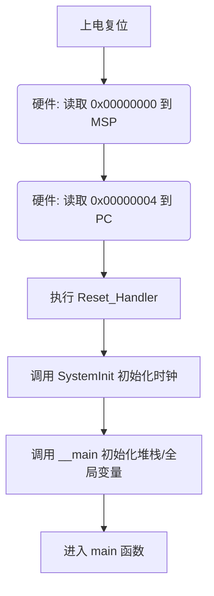

# STM32 启动机制与启动文件详解

本文档基于 `startup_stm32f401xe.s` 文件，详细解析 STM32F4 系列单片机的启动过程。

## 1. 启动模式 (Boot Modes)

STM32 芯片通过 `BOOT0` 和 `BOOT1` 引脚的电平状态，决定复位后从哪里开始执行程序。这就好比电脑的 BIOS 设置是从硬盘启动、U盘启动还是光盘启动。

| BOOT0 | BOOT1 | 启动模式 | 映射地址 | 说明 |
| :--- | :--- | :--- | :--- | :--- |
| **0** | **X** | **Main Flash Memory** (主闪存) | `0x0000 0000` | **最常用模式**。程序存储在芯片内置 Flash 中，上电直接运行用户程序。 |
| **1** | **0** | **System Memory** (系统存储器) | `0x0000 0000` | **ISP 下载模式**。运行芯片出厂时预置的 Bootloader（只读），用于通过串口 (UART) 下载程序到 Flash。 |
| **1** | **1** | **Embedded SRAM** (内置 SRAM) | `0x0000 0000` | **调试模式**。程序在 RAM 中运行，速度快但掉电丢失，常用于快速调试或解除 Flash 锁死。 |

> **注意**：无论哪种模式，CPU 复位后都会去访问 `0x0000 0000` 地址。STM32 内部的硬件机制会将选定的存储器（Flash/System Memory/SRAM）**映射 (Alias)** 到 `0x0000 0000`。

---

## 2. 启动流程概览

当 STM32 上电或复位时，硬件会自动执行以下步骤（无需代码控制）：

1.  **读取 MSP 初始值**：CPU 从地址 `0x0000 0000` 读取 4 字节数据，加载到 **MSP (Main Stack Pointer)** 寄存器。
2.  **读取 PC 初始值**：CPU 从地址 `0x0000 0004` 读取 4 字节数据，加载到 **PC (Program Counter)** 寄存器。这个值通常是 `Reset_Handler` 的地址。
3.  **执行复位中断服务程序**：CPU 跳转到 `Reset_Handler` 开始执行第一条指令。
4.  **初始化系统**：`Reset_Handler` 调用 `SystemInit()` 配置时钟，然后调用 `__main` 初始化 C 库环境。
5.  **进入用户主程序**：最后跳转到 `main()` 函数。



---

## 3. 启动文件 (`startup_stm32f401xe.s`) 深度解析

启动文件主要完成了以下工作：

### 3.1 定义堆栈 (Stack & Heap)

```assembly
Stack_Size      EQU     0x00000400                ; 定义栈大小 1KB
                AREA    STACK, NOINIT, READWRITE, ALIGN=3
Stack_Mem       SPACE   Stack_Size
__initial_sp                                      ; 栈顶地址标号

Heap_Size       EQU     0x00000200                ; 定义堆大小 512B
                AREA    HEAP, NOINIT, READWRITE, ALIGN=3
__heap_base
Heap_Mem        SPACE   Heap_Size
__heap_limit
```

*   **Stack (栈)**：用于局部变量、函数调用现场保护。**向下生长**。
*   **Heap (堆)**：用于 `malloc` 动态内存分配。**向上生长**。
*   **ALIGN=3**：8 字节对齐，防止 64 位指令或浮点运算出错。

### 3.2 定义中断向量表 (Vector Table)

这是启动文件的核心部分，位于 Flash 的起始位置。

```assembly
                AREA    RESET, DATA, READONLY
                EXPORT  __Vectors
                EXPORT  __Vectors_End
                EXPORT  __Vectors_Size

__Vectors       DCD     __initial_sp               ; [0] MSP 初始值
                DCD     Reset_Handler              ; [1] 复位入口地址
                DCD     NMI_Handler                ; [2] NMI 中断
                DCD     HardFault_Handler          ; [3] 硬件错误中断
                ; ... 其他系统异常和外设中断 ...
__Vectors_End
```

*   **DCD**：分配 4 字节空间并初始化。
*   **第 0 项**：必须是栈顶地址（MSP）。
*   **第 1 项**：必须是复位处理函数地址（Reset_Handler）。

### 3.3 复位处理函数 (Reset_Handler)

这是程序开始执行的**第一段代码**。

```assembly
                AREA    |.text|, CODE, READONLY

Reset_Handler   PROC
                EXPORT  Reset_Handler             [WEAK]
                IMPORT  SystemInit
                IMPORT  __main

                LDR     R0, =SystemInit
                BLX     R0                        ; 1. 调用 SystemInit()
                LDR     R0, =__main
                BX      R0                        ; 2. 跳转到 C 库初始化 (__main)
                ENDP
```

*   **SystemInit**：在 `system_stm32f4xx.c` 中定义，负责初始化系统时钟（PLL）、Flash 延时周期等，使芯片工作在高性能状态。
*   **__main**：C 库提供的标准初始化函数。它会：
    1.  将代码中的 `.data` 段（已初始化的全局变量）从 Flash 复制到 RAM。
    2.  将 `.bss` 段（未初始化的全局变量）在 RAM 中清零。
    3.  初始化堆栈。
    4.  最后跳转到用户的 `main()` 函数。

---

## 4. 常见问题

### Q1: 为什么第 0 项必须是 MSP？
答：因为在执行任何指令之前（包括 `Reset_Handler`），CPU 可能会遇到 NMI 或 HardFault。如果没有合法的栈指针，CPU 无法压栈保存现场，会导致双重错误 (Double Fault) 并死机。

### Q2: `__main` 和 `main` 有什么区别？
答：
*   `__main` 是编译器提供的 C 库入口，负责“打扫战场”（搬运数据、清零内存），搭建 C 语言运行环境。
*   `main` 是用户编写的逻辑入口。
*   如果直接跳过 `__main` 去执行 `main`，你的全局变量初始值将是随机的，因为 `.data` 段还没从 Flash 搬到 RAM。

### Q3: 栈溢出 (Stack Overflow) 会发生什么？
答：如果局部变量太多或递归太深，栈指针 (SP) 会向下越界，覆盖掉堆 (Heap) 或其他静态变量的数据，导致程序运行逻辑异常，甚至进入 HardFault。

---

## 5. 参考资料
*   STM32F401 Reference Manual (RM0368) - Boot configuration
*   Cortex-M4 Generic User Guide - Exception Model
