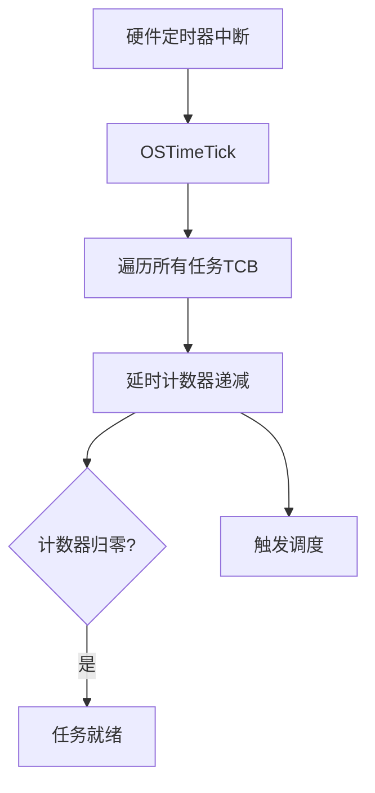
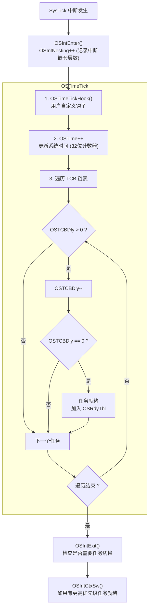
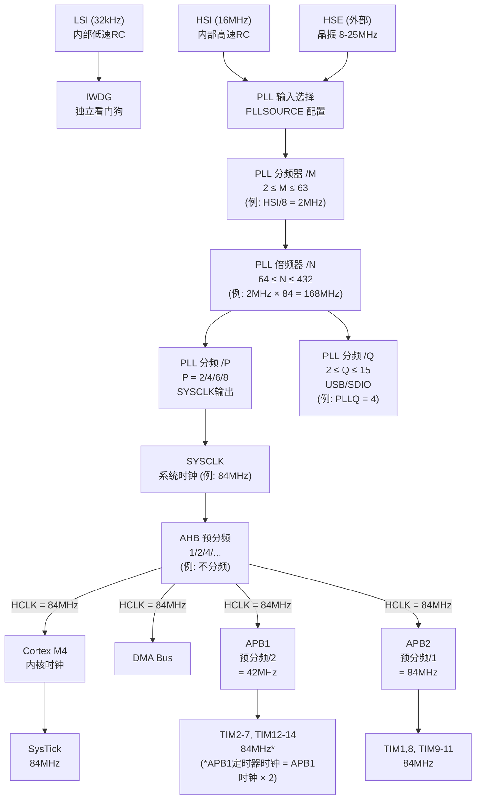
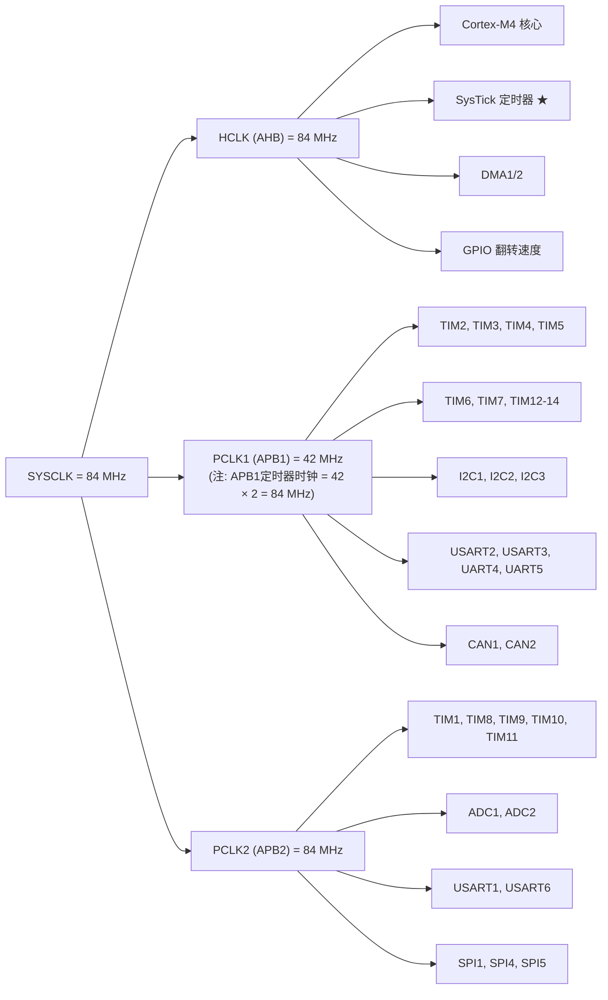
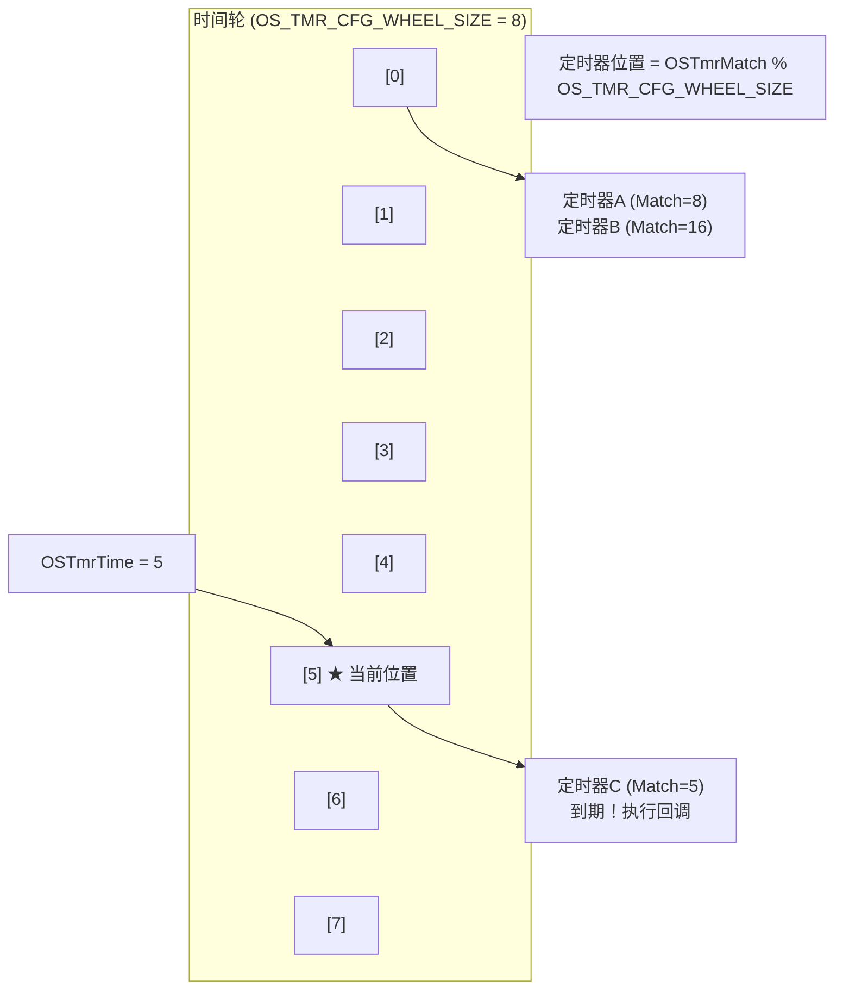
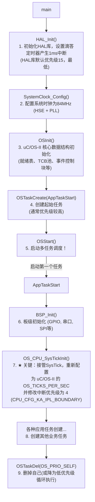
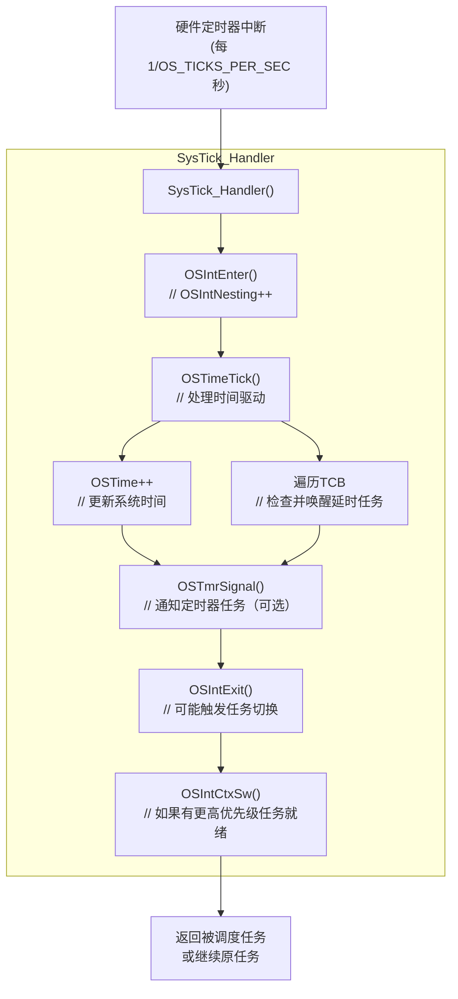
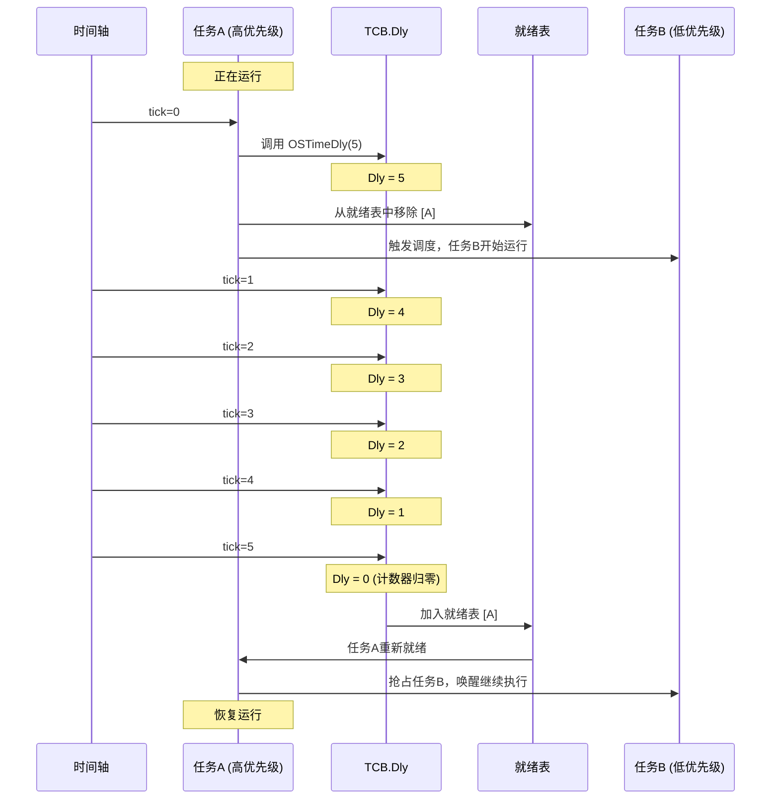

# uC/OS-II 时间驱动机制详解

## 目录

1. [概述](#1-概述)
2. [时钟节拍 (Clock Tick)](#2-时钟节拍-clock-tick)
3. [STM32 时钟树配置](#3-stm32-时钟树配置)
4. [时间管理服务](#4-时间管理服务)
5. [软件定时器](#5-软件定时器)
6. [时间驱动的工作流程](#6-时间驱动的工作流程)
7. [应用示例](#7-应用示例)

---

## 1. 概述

uC/OS-II 是一个**时间驱动**的抢占式实时操作系统。整个系统的运行依赖于一个稳定的时间基准——**时钟节拍 (Clock Tick)**。

### 1.1 时间驱动的核心思想



**时间驱动机制的关键作用：**

1. **任务延时** - 任务可以主动挂起指定时间
2. **超时机制** - 等待事件时可设置超时
3. **软件定时器** - 提供周期性或单次定时回调
4. **时间片轮转** - 可选的时间片调度支持

---

## 2. 时钟节拍 (Clock Tick)

### 2.1 硬件基础

时钟节拍由硬件定时器产生周期性中断实现。在 STM32 上通常使用 **SysTick** 定时器：

```c
// 通常在 main.c 或 stm32f4xx_it.c 中配置
void SysTick_Handler(void)          // SysTick 中断服务程序
{
    OSIntEnter();                   // 通知 uC/OS-II 进入中断
    OSTimeTick();                   // 处理时钟节拍 ★ 核心函数
    OSIntExit();                    // 退出中断，可能触发调度
}
```

### 2.2 时钟节拍频率配置

时钟节拍频率通过 `OS_TICKS_PER_SEC` 宏定义（通常在 `os_cfg.h` 中）：

```c
#define OS_TICKS_PER_SEC     100u   // 每秒100次，即10ms一个tick
```

| 频率设置 | Tick周期 | 适用场景 |
|---------|---------|---------|
| 10 Hz   | 100 ms  | 低功耗应用 |
| 100 Hz  | 10 ms   | 一般应用（常用） |
| 1000 Hz | 1 ms    | 高精度时间控制 |

### 2.3 OSTimeTick() 核心实现

**源码位置**: `os_core.c`

```c
void OSTimeTick(void)
{
    OS_TCB *ptcb;
    
    // 1. 调用用户钩子函数（可选）
    #if OS_TIME_TICK_HOOK_EN > 0u
        OSTimeTickHook();
    #endif
    
    // 2. 更新系统时间计数器
    OS_ENTER_CRITICAL();
    OSTime++;                        // 32位系统时间计数器
    OS_EXIT_CRITICAL();
    
    // 3. 遍历所有任务的TCB，处理延时
    if (OSRunning == OS_TRUE) {
        ptcb = OSTCBList;            // 从TCB链表头部开始
        
        while (ptcb->OSTCBPrio != OS_TASK_IDLE_PRIO) {  // 直到空闲任务
            
            OS_ENTER_CRITICAL();
            if (ptcb->OSTCBDly != 0u) {        // 任务有延时计数
                ptcb->OSTCBDly--;              // 延时计数减1
                
                if (ptcb->OSTCBDly == 0u) {    // 延时到期！
                    
                    // 清除等待状态
                    if ((ptcb->OSTCBStat & OS_STAT_PEND_ANY) != OS_STAT_RDY) {
                        ptcb->OSTCBStat &= ~(INT8U)OS_STAT_PEND_ANY;
                        ptcb->OSTCBStatPend = OS_STAT_PEND_TO;  // 标记超时
                    }
                    
                    // 将任务加入就绪表（如果未被挂起）
                    if ((ptcb->OSTCBStat & OS_STAT_SUSPEND) == OS_STAT_RDY) {
                        OSRdyGrp |= ptcb->OSTCBBitY;
                        OSRdyTbl[ptcb->OSTCBY] |= ptcb->OSTCBBitX;
                    }
                }
            }
            ptcb = ptcb->OSTCBNext;  // 处理下一个任务
            OS_EXIT_CRITICAL();
        }
    }
}
```

### 2.4 OSTimeTick() 执行流程图



---

## 3. STM32 时钟树配置

### 3.1 时钟树概述

STM32 的时钟系统是一个复杂的树形结构，理解时钟树对于正确配置系统时间基准至关重要。

#### STM32F401RE 时钟树结构图



### 3.2 时钟源详解

| 时钟源 | 频率 | 特点 | 适用场景 |
|--------|------|------|----------|
| **HSI** (High Speed Internal) | 16 MHz | 内部RC振荡器，精度较低 (±1%) | 无外部晶振时的默认选择 |
| **HSE** (High Speed External) | 4-26 MHz | 外部晶振，精度高 (±30ppm) | 需要高精度时钟的应用 |
| **LSI** (Low Speed Internal) | 32 kHz | 内部低速RC，功耗低 | 独立看门狗、RTC |
| **LSE** (Low Speed External) | 32.768 kHz | 外部低速晶振 | RTC实时时钟 |

### 3.3 PLL 配置详解

PLL (Phase-Locked Loop) 锁相环是将时钟源倍频到所需系统时钟的关键模块。

#### PLL 配置参数

```c
typedef struct {
    uint32_t PLLState;      // PLL使能/失能
    uint32_t PLLSource;     // PLL输入源 (HSI 或 HSE)
    uint32_t PLLM;          // 输入分频系数 (2-63)
    uint32_t PLLN;          // VCO倍频系数 (64-432)
    uint32_t PLLP;          // 主输出分频 (2/4/6/8)
    uint32_t PLLQ;          // USB/SDIO分频 (2-15)
} RCC_PLLInitTypeDef;
```

#### 频率计算公式

```
VCO频率 = (PLL输入频率 / PLLM) × PLLN

SYSCLK = VCO频率 / PLLP

USB时钟 = VCO频率 / PLLQ
```

#### STM32F401RE 配置示例 (84MHz SYSCLK)

```c
// 使用 HSI (16MHz) 作为PLL源
// 目标: SYSCLK = 84MHz

PLL输入 = HSI = 16 MHz
PLLM = 8        →  PLL输入分频后 = 16/8 = 2 MHz (参考时钟)
PLLN = 84       →  VCO频率 = 2 × 84 = 168 MHz
PLLP = 2        →  SYSCLK = 168/2 = 84 MHz ✓
PLLQ = 4        →  USB时钟 = 168/4 = 42 MHz
```

**重要限制**:
- VCO输入频率必须在 1-2 MHz 范围内
- VCO输出频率必须在 100-432 MHz 范围内
- SYSCLK 最大频率: STM32F401RE = 84 MHz

### 3.4 HAL库时钟配置实现

**源码位置**: `main.c` 中的 `SystemClock_Config()`

```c
void SystemClock_Config(void)
{
    RCC_OscInitTypeDef RCC_OscInitStruct = {0};
    RCC_ClkInitTypeDef RCC_ClkInitStruct = {0};

    /* 1. 配置电源电压范围 */
    __HAL_RCC_PWR_CLK_ENABLE();
    __HAL_PWR_VOLTAGESCALING_CONFIG(PWR_REGULATOR_VOLTAGE_SCALE2);
    // SCALE2: 适合 84MHz 以下频率，功耗更低

    /* 2. 配置振荡器和PLL */
    RCC_OscInitStruct.OscillatorType = RCC_OSCILLATORTYPE_HSI;
    RCC_OscInitStruct.HSIState = RCC_HSI_ON;
    RCC_OscInitStruct.HSICalibrationValue = RCC_HSICALIBRATION_DEFAULT;
    
    // PLL配置
    RCC_OscInitStruct.PLL.PLLState = RCC_PLL_ON;
    RCC_OscInitStruct.PLL.PLLSource = RCC_PLLSOURCE_HSI;  // HSI作为PLL源
    RCC_OscInitStruct.PLL.PLLM = 8;    // HSI(16MHz)/8 = 2MHz
    RCC_OscInitStruct.PLL.PLLN = 84;   // 2MHz × 84 = 168MHz (VCO)
    RCC_OscInitStruct.PLL.PLLP = RCC_PLLP_DIV2;  // 168MHz/2 = 84MHz (SYSCLK)
    RCC_OscInitStruct.PLL.PLLQ = 4;    // 168MHz/4 = 42MHz (USB)

    if (HAL_RCC_OscConfig(&RCC_OscInitStruct) != HAL_OK) {
        Error_Handler();  // 配置失败，进入错误处理
    }

    /* 3. 配置系统时钟分频 */
    RCC_ClkInitStruct.ClockType = RCC_CLOCKTYPE_HCLK   |   // AHB时钟
                                   RCC_CLOCKTYPE_SYSCLK |   // 系统时钟
                                   RCC_CLOCKTYPE_PCLK1  |   // APB1时钟
                                   RCC_CLOCKTYPE_PCLK2;     // APB2时钟
    
    RCC_ClkInitStruct.SYSCLKSource = RCC_SYSCLKSOURCE_PLLCLK;  // 使用PLL作为系统时钟
    RCC_ClkInitStruct.AHBCLKDivider = RCC_SYSCLK_DIV1;    // AHB = SYSCLK = 84MHz
    RCC_ClkInitStruct.APB1CLKDivider = RCC_HCLK_DIV2;     // APB1 = HCLK/2 = 42MHz
    RCC_ClkInitStruct.APB2CLKDivider = RCC_HCLK_DIV1;     // APB2 = HCLK = 84MHz

    // Flash延迟配置 (根据SYSCLK频率)
    if (HAL_RCC_ClockConfig(&RCC_ClkInitStruct, FLASH_LATENCY_2) != HAL_OK) {
        Error_Handler();
    }
}
```

### 3.5 Flash 延迟配置

由于 Flash 读取速度有限，当 SYSCLK 频率较高时，需要插入等待周期：

| SYSCLK 频率 | Flash 延迟 | 宏定义 |
|-------------|------------|--------|
| 0 < f ≤ 30 MHz | 0 等待 | `FLASH_LATENCY_0` |
| 30 < f ≤ 60 MHz | 1 等待 | `FLASH_LATENCY_1` |
| 60 < f ≤ 84 MHz | 2 等待 | `FLASH_LATENCY_2` |

### 3.6 总线时钟关系



### 3.7 SysTick 定时器配置

SysTick 是 Cortex-M 内核自带的 24 位递减计数器，是 uC/OS-II 时钟节拍的硬件基础。

#### SysTick 寄存器

```
┌─────────────────────────────────────────────────────────────────┐
│                    SysTick 控制及状态寄存器 (STK_CTRL)           │
│                    地址: 0xE000E010                              │
├─────┬─────┬─────┬─────┬─────┬────────────────────────────────────┤
│Bit31│ ... │Bit17│Bit16│ ... │ Bit2  Bit1   Bit0                 │
│     │     │     │COUNT│     │CLKSRC TICKINT ENABLE              │
│     │     │     │FLAG │     │       │       │                   │
└─────┴─────┴─────┴─────┴─────┴───────┴───────┴───────────────────┘
  COUNTFLAG: 计数到0时置1
  CLKSOURCE: 0=外部时钟, 1=CPU时钟
  TICKINT:   0=禁止中断, 1=使能中断
  ENABLE:    0=禁止, 1=使能

┌─────────────────────────────────────────────────────────────────┐
│                    SysTick 重装载值寄存器 (STK_LOAD)             │
│                    地址: 0xE000E014                              │
├─────────────────────────────────────────────────────────────────┤
│ Bit23 - Bit0: RELOAD值 (0 到 0xFFFFFF)                          │
│              计数器减到0后，自动重装载此值                         │
└─────────────────────────────────────────────────────────────────┘

┌─────────────────────────────────────────────────────────────────┐
│                    SysTick 当前值寄存器 (STK_VAL)                │
│                    地址: 0xE000E018                              │
├─────────────────────────────────────────────────────────────────┤
│ Bit23 - Bit0: CURRENT值 (读取或写入都会清除)                     │
└─────────────────────────────────────────────────────────────────┘
```

#### `os_cpu_c.c` 中这些宏到底在做什么

在 os_cpu_c.c里，uC/OS-II 没有使用 CMSIS 提供的结构体访问寄存器，而是直接把寄存器地址定义成“可读可写的 32 位 volatile 变量”：

```c
#define  OS_CPU_CM_SYST_CSR         (*((volatile INT32U *)0xE000E010uL))
#define  OS_CPU_CM_SYST_RVR         (*((volatile INT32U *)0xE000E014uL))
#define  OS_CPU_CM_SYST_CVR         (*((volatile INT32U *)0xE000E018uL))
#define  OS_CPU_CM_SYST_CALIB       (*((volatile INT32U *)0xE000E01CuL))
#define  OS_CPU_CM_SCB_SHPRI1       (*((volatile INT32U *)0xE000ED18uL))
#define  OS_CPU_CM_SCB_SHPRI2       (*((volatile INT32U *)0xE000ED1CuL))
#define  OS_CPU_CM_SCB_SHPRI3       (*((volatile INT32U *)0xE000ED20uL))
```

这类写法可以理解成：

- `0xE000E010`、`0xE000ED20` 这些地址不是普通 RAM，而是 Cortex-M 内核的**内存映射寄存器**
- `volatile` 告诉编译器：这些值可能被硬件随时改变，每次都必须真的去读写，不能优化掉
- `*((volatile INT32U *)地址)` 的意思是“把这个地址当成一个 32 位无符号寄存器来访问”
- 所以后续代码里写 `OS_CPU_CM_SYST_CSR |= ...`，本质上就是在直接操作内核寄存器

#### 宏与硬件寄存器一一对应关系

| 宏名 | 地址 | 对应寄存器 | 作用 |
|------|------|------------|------|
| `OS_CPU_CM_SYST_CSR` | `0xE000E010` | SysTick Control and Status Register | 控制 SysTick 开关、时钟源和中断使能 |
| `OS_CPU_CM_SYST_RVR` | `0xE000E014` | SysTick Reload Value Register | 设置计数周期 |
| `OS_CPU_CM_SYST_CVR` | `0xE000E018` | SysTick Current Value Register | 保存当前倒计数值 |
| `OS_CPU_CM_SYST_CALIB` | `0xE000E01C` | SysTick Calibration Register | 提供校准信息 |
| `OS_CPU_CM_SCB_SHPRI1` | `0xE000ED18` | System Handler Priority Register 1 | 配置系统异常 4~7 的优先级 |
| `OS_CPU_CM_SCB_SHPRI2` | `0xE000ED1C` | System Handler Priority Register 2 | 配置系统异常 8~11 的优先级 |
| `OS_CPU_CM_SCB_SHPRI3` | `0xE000ED20` | System Handler Priority Register 3 | 配置系统异常 12~15 的优先级 |

#### `OS_CPU_CM_SYST_CSR`：SysTick 控制寄存器

这个寄存器决定 SysTick 是否开始计数、是否产生中断、使用哪一路时钟。

在 os_cpu_c.c中又定义了 4 个位掩码：

```c
#define  OS_CPU_CM_SYST_CSR_COUNTFLAG   0x00010000uL
#define  OS_CPU_CM_SYST_CSR_CLKSOURCE   0x00000004uL
#define  OS_CPU_CM_SYST_CSR_TICKINT     0x00000002uL
#define  OS_CPU_CM_SYST_CSR_ENABLE      0x00000001uL
```

它们的含义如下：

| 位 | 掩码 | 名称 | 含义 |
|----|------|------|------|
| Bit16 | `0x00010000` | `COUNTFLAG` | 计数器从 1 递减到 0 时置 1，读寄存器后清除 |
| Bit2 | `0x00000004` | `CLKSOURCE` | `1` 表示使用处理器时钟（通常是 HCLK），`0` 表示外部参考时钟 |
| Bit1 | `0x00000002` | `TICKINT` | `1` 表示计数到 0 时触发 SysTick 异常 |
| Bit0 | `0x00000001` | `ENABLE` | `1` 表示启动 SysTick 计数器 |

uC/OS-II 初始化 SysTick 时，通常会执行类似操作：

```c
OS_CPU_CM_SYST_CSR |= OS_CPU_CM_SYST_CSR_CLKSOURCE |
                      OS_CPU_CM_SYST_CSR_ENABLE;
OS_CPU_CM_SYST_CSR |= OS_CPU_CM_SYST_CSR_TICKINT;
```

这三步合起来就是：

- 选择 SysTick 使用内核时钟
- 打开 SysTick 递减计数器
- 允许计数到 0 时产生异常，进入 `SysTick_Handler`

#### `OS_CPU_CM_SYST_RVR`：重装载寄存器

这个寄存器决定“一个 tick 要数多少拍”。

如果系统时钟是 84 MHz，操作系统节拍率是 100 Hz，那么：

```c
cnts = 84000000 / 100 = 840000
OS_CPU_CM_SYST_RVR = cnts - 1 = 839999
```

原因是 SysTick 的实际周期公式是：

```text
Tick 周期 = (RELOAD + 1) / SysTick 时钟频率
```

所以写入 `839999`，实际上表示数 `840000` 个时钟周期，也就是 10 ms 触发一次中断。

#### `OS_CPU_CM_SYST_CVR`：当前值寄存器

这个寄存器反映“当前已经数到哪里了”。

- 读取它，可以看到当前剩余计数值
- 向它写任意值，会把当前计数器清零
- 清零后，硬件会在下一拍重新从 `RVR` 的值开始倒数

在初始化时，很多移植层会先清一下 `CVR`，确保计数器从一个确定状态启动。

#### `OS_CPU_CM_SYST_CALIB`：校准寄存器

这个寄存器通常由芯片厂商预先写好，用来描述一个“参考时间基准”。

它常见的用途是：

- 判断芯片是否提供了 10 ms 参考校准值
- 确认参考时钟是否精确
- 给裸机或操作系统做时间基准估算

不过在很多 uC/OS-II 工程里，这个寄存器**只是保留定义，不一定真的会使用**，因为实际 tick 周期通常由 `HCLK / OS_TICKS_PER_SEC` 直接计算出来。

#### `OS_CPU_CM_SCB_SHPRI1/2/3`：系统异常优先级寄存器

这 3 个寄存器不是给普通外设中断用的，而是专门给 **Cortex-M 内核异常** 配优先级的。

也就是说，它们管理的是：

- MemManage
- BusFault
- UsageFault
- SVCall
- Debug Monitor
- PendSV
- SysTick

而不是 USART、TIM、EXTI 这类外设 IRQ。

在 uC/OS-II 里最重要的是 `OS_CPU_CM_SCB_SHPRI3`，因为它同时包含：

- **PendSV 优先级**
- **SysTick 优先级**

它的典型位分布可以理解为：

| 位段 | 对应异常 | 说明 |
|------|----------|------|
| `[31:24]` | SysTick 或 PendSV 之一 | 具体顺序按 ARMv7-M 定义 |
| `[23:16]` | SysTick 或 PendSV 之一 | uC/OS-II 常通过屏蔽再写入来单独改其中一个 |
| `[15:8]` | 保留/其他系统异常 | 取决于具体异常映射 |
| `[7:0]` | Debug Monitor | 调试异常优先级 |

在实际移植代码里，uC/OS-II 会对 `SHPRI3` 做“读-改-写”：

- 先读出整个 32 位寄存器
- 用位掩码清掉目标异常对应的 8 位
- 再把新的优先级值写回去

这么做的目的，是**只修改 PendSV 或 SysTick 的优先级，而不破坏同一个寄存器里其他异常的优先级设置**。

#### 为什么这些寄存器对时间驱动机制很重要

uC/OS-II 的时间驱动链路实际上就是靠这几组寄存器串起来的：

1. `OS_CPU_CM_SYST_RVR` 决定一个 tick 的时间长度
2. `OS_CPU_CM_SYST_CSR` 启动 SysTick，并允许到 0 产生异常
3. CPU 进入 `SysTick_Handler`
4. 中断服务里调用 `OSTimeTick()`，更新延时计数和系统时基
5. 如果需要任务切换，再由 PendSV 负责真正的上下文切换
6. PendSV 和 SysTick 的优先级关系，则由 `OS_CPU_CM_SCB_SHPRI3` 控制

从这个角度看：

- `SYST_CSR/RVR/CVR/CALIB` 管的是“**多久产生一次时钟节拍**”
- `SCB_SHPRI1/2/3` 管的是“**系统异常谁先执行，谁后执行**”

前者解决“时间基准”，后者解决“中断与调度次序”。这两部分合起来，才构成了 Cortex-M 上 uC/OS-II 的时间驱动底座。

#### uC/OS-II 的 SysTick 初始化

**源码位置**: `os_cpu_c.c`

```c
void OS_CPU_SysTickInit(INT32U cnts)
{
    INT32U prio;
    INT32U basepri;

    // 设置 SysTick 重装载值
    // cnts = HCLK频率 / OS_TICKS_PER_SEC
    OS_CPU_CM_SYST_RVR = cnts - 1u;  // 例如: 84000000/100 - 1 = 839999

    // 设置 SysTick 中断优先级
    prio = OS_CPU_CM_SCB_SHPRI3;
    prio &= 0x00FFFFFFu;
    prio |= (basepri << 24u);
    OS_CPU_CM_SCB_SHPRI3 = prio;

    // 使能 SysTick 定时器，使用 CPU 时钟源
    OS_CPU_CM_SYST_CSR |= OS_CPU_CM_SYST_CSR_CLKSOURCE |
                          OS_CPU_CM_SYST_CSR_ENABLE;

    // 使能 SysTick 中断
    OS_CPU_CM_SYST_CSR |= OS_CPU_CM_SYST_CSR_TICKINT;
}
```

#### 在应用中调用 SysTick 初始化

```c
static void AppTaskStart(void *p_arg)
{
    (void)p_arg;

    // 初始化 SysTick
    // 参数 = HCLK频率 / 每秒tick数
    // 84MHz / 100 = 840000
    OS_CPU_SysTickInit(HAL_RCC_GetHCLKFreq() / OS_TICKS_PER_SEC);

    // ... 其他初始化
}
```

### 3.8 时钟配置验证

配置完成后，可以通过以下代码验证时钟配置：

```c
void PrintClockInfo(void)
{
    printf("SystemCoreClock = %lu Hz\r\n", SystemCoreClock);
    printf("HCLK  = %lu Hz\r\n", HAL_RCC_GetHCLKFreq());
    printf("PCLK1 = %lu Hz\r\n", HAL_RCC_GetPCLK1Freq());
    printf("PCLK2 = %lu Hz\r\n", HAL_RCC_GetPCLK2Freq());
    
    // 对于 APB1 定时器，时钟可能是 PCLK1 × 2
    if ((RCC->CFGR & RCC_CFGR_PPRE1) != 0) {
        printf("APB1 Timer Clock = %lu Hz (PCLK1 × 2)\r\n", 
               HAL_RCC_GetPCLK1Freq() * 2);
    }
}
```

### 3.9 时钟配置常见问题

#### 问题1: SysTick 中断频率不正确

**原因**: `OS_TICKS_PER_SEC` 与实际 SysTick 配置不匹配

**解决**:
```c
// 确保 SysTick 重装载值计算正确
// SysTick频率 = HCLK / (RVR + 1)
// Tick周期 = (RVR + 1) / HCLK

// 例: HCLK = 84MHz, 需要 100Hz tick
// RVR = 84MHz / 100 - 1 = 839999
```

#### 问题2: 使用 HSE 晶振启动失败

**原因**: 晶振频率与 PLLM 配置不匹配，或硬件焊接问题

**解决**:
```c
// 检查晶振频率，调整 PLLM 使 VCO 输入在 1-2MHz
// 例: HSE = 8MHz
// PLLM = 8 → 8MHz / 8 = 1MHz (VCO输入)
```

#### 问题3: USB 时钟不正确

**原因**: PLLQ 配置不当

**解决**:
```c
// USB 需要 48MHz 时钟
// VCO = 168MHz 时，PLLQ = 168/48 = 3.5 (不是整数!)
// 解决: 调整 PLLN 使 VCO 能被 48 整除
// 例: PLLN = 96, VCO = 192MHz
// PLLP = 2 → SYSCLK = 96MHz
// PLLQ = 4 → USB = 48MHz ✓
```

---

## 4. 时间管理服务

### 4.1 OSTimeDly() - 任务延时

**功能**: 将当前任务挂起指定的时钟节拍数。

**源码位置**: `os_time.c`

```c
void OSTimeDly(INT32U ticks)
{
    INT8U y;
    
    // 安全检查：不能从中断调用
    if (OSIntNesting > 0u) {
        return;
    }
    // 安全检查：调度器未被锁定
    if (OSLockNesting > 0u) {
        return;
    }
    
    if (ticks > 0u) {
        OS_ENTER_CRITICAL();
        
        // 1. 从就绪表中移除当前任务
        y = OSTCBCur->OSTCBY;
        OSRdyTbl[y] &= ~OSTCBCur->OSTCBBitX;
        if (OSRdyTbl[y] == 0u) {
            OSRdyGrp &= ~OSTCBCur->OSTCBBitY;
        }
        
        // 2. 设置延时计数
        OSTCBCur->OSTCBDly = ticks;
        
        OS_EXIT_CRITICAL();
        
        // 3. 触发调度，切换到其他任务
        OS_Sched();
    }
}
```

**使用示例**:

```c
void Task1(void *p_arg)
{
    (void)p_arg;
    
    while (1) {
        // 执行任务工作...
        
        OSTimeDly(10);  // 延时10个tick（假设100Hz，即延时100ms）
    }
}
```

### 4.2 OSTimeDlyHMSM() - 时分秒毫秒延时

**功能**: 以更直观的时、分、秒、毫秒格式设置延时。

```c
INT8U OSTimeDlyHMSM(INT8U hours, INT8U minutes, INT8U seconds, INT16U ms)
{
    INT32U ticks;
    
    // 参数验证
    if (minutes > 59u || seconds > 59u || ms > 999u) {
        return OS_ERR_INVALID_PARAM;
    }
    
    // 将时间转换为tick数
    ticks = ((INT32U)hours * 3600uL + 
             (INT32U)minutes * 60uL + 
             (INT32U)seconds) * OS_TICKS_PER_SEC
            + OS_TICKS_PER_SEC * ((INT32U)ms + 500uL / OS_TICKS_PER_SEC) / 1000uL;
    
    OSTimeDly(ticks);
    return OS_ERR_NONE;
}
```

**使用示例**:

```c
void Task1(void *p_arg)
{
    while (1) {
        // 执行任务...
        
        // 延时 1秒 500毫秒
        OSTimeDlyHMSM(0, 0, 1, 500);
    }
}
```

### 4.3 OSTimeDlyResume() - 提前唤醒延时任务

**功能**: 强制结束一个任务的延时状态。

```c
INT8U OSTimeDlyResume(INT8U prio)
{
    OS_TCB *ptcb;
    
    OS_ENTER_CRITICAL();
    
    ptcb = OSTCBPrioTbl[prio];
    
    if (ptcb == (OS_TCB *)0) {
        OS_EXIT_CRITICAL();
        return OS_ERR_TASK_NOT_EXIST;
    }
    
    if (ptcb->OSTCBDly == 0u) {
        OS_EXIT_CRITICAL();
        return OS_ERR_TIME_NOT_DLY;  // 任务并未在延时
    }
    
    // 清除延时计数
    ptcb->OSTCBDly = 0u;
    
    // 将任务加入就绪表
    if ((ptcb->OSTCBStat & OS_STAT_SUSPEND) == OS_STAT_RDY) {
        OSRdyGrp |= ptcb->OSTCBBitY;
        OSRdyTbl[ptcb->OSTCBY] |= ptcb->OSTCBBitX;
    }
    
    OS_EXIT_CRITICAL();
    OS_Sched();  // 触发调度
    
    return OS_ERR_NONE;
}
```

### 4.4 OSTimeGet() / OSTimeSet() - 系统时间管理

```c
// 获取当前系统时间（tick数）
INT32U OSTimeGet(void)
{
    INT32U ticks;
    OS_ENTER_CRITICAL();
    ticks = OSTime;
    OS_EXIT_CRITICAL();
    return ticks;
}

// 设置系统时间
void OSTimeSet(INT32U ticks)
{
    OS_ENTER_CRITICAL();
    OSTime = ticks;
    OS_EXIT_CRITICAL();
}
```

---

## 5. 软件定时器

### 5.1 概述

软件定时器允许用户创建周期性或单次触发的定时器，到期时执行用户指定的回调函数。

**关键特性**:
- 支持单次模式 (ONE-SHOT) 和周期模式 (PERIODIC)
- 定时器管理由独立任务 `OSTmr_Task` 处理
- 使用时间轮 (Timer Wheel) 数据结构管理定时器

### 5.2 核心数据结构

#### 定时器控制块 (OS_TMR)

```c
typedef struct os_tmr {
    INT8U            OSTmrType;         // 类型标识（必须是 OS_TMR_TYPE）
    INT8U            OSTmrState;        // 定时器状态
    INT8U            OSTmrOpt;          // 选项：ONE_SHOT 或 PERIODIC
    INT32U           OSTmrDly;          // 初始延时（tick数）
    INT32U           OSTmrPeriod;       // 周期（tick数）
    INT32U           OSTmrMatch;        // 到期时间戳
    OS_TMR_CALLBACK  OSTmrCallback;     // 回调函数指针
    void            *OSTmrCallbackArg;  // 回调函数参数
    void            *OSTmrNext;         // 链表下一个节点
    void            *OSTmrPrev;         // 链表前一个节点
#if OS_TMR_CFG_NAME_EN > 0u
    INT8U           *OSTmrName;         // 定时器名称
#endif
} OS_TMR;
```

#### 定时器状态

```c
#define OS_TMR_STATE_UNUSED     0u  // 未使用
#define OS_TMR_STATE_STOPPED    1u  // 已停止
#define OS_TMR_STATE_COMPLETED  2u  // 已完成（ONE-SHOT模式到期）
#define OS_TMR_STATE_RUNNING    3u  // 正在运行
```

#### 时间轮 (Timer Wheel)

```c
typedef struct os_tmr_wheel {
    OS_TMR  *OSTmrFirst;     // 该槽位的第一个定时器
    INT16U   OSTmrEntries;   // 该槽位的定时器数量
} OS_TMR_WHEEL;

OS_TMR_WHEEL  OSTmrWheelTbl[OS_TMR_CFG_WHEEL_SIZE];  // 时间轮数组
```

### 5.3 时间轮工作原理

时间轮是一种高效管理大量定时器的数据结构：



**优点**:
- 插入定时器: O(1)
- 删除定时器: O(1)
- 处理到期定时器: 平均 O(1)

### 5.4 定时器管理任务 OSTmr_Task()

**源码位置**: `os_tmr.c`

```c
static void OSTmr_Task(void *p_arg)
{
    OS_TMR *ptmr;
    OS_TMR *ptmr_next;
    OS_TMR_CALLBACK pfnct;
    OS_TMR_WHEEL *pspoke;
    INT16U spoke;
    
    p_arg = p_arg;  // 防止编译警告
    
    for (;;) {
        // 1. 等待信号量（由 OSTmrSignal() 发送）
        OSSemPend(OSTmrSemSignal, 0u, &err);
        
        OSSchedLock();
        
        // 2. 更新定时器时间
        OSTmrTime++;
        
        // 3. 计算当前时间轮位置
        spoke = (INT16U)(OSTmrTime % OS_TMR_CFG_WHEEL_SIZE);
        pspoke = &OSTmrWheelTbl[spoke];
        
        // 4. 遍历该槽位的所有定时器
        ptmr = pspoke->OSTmrFirst;
        while (ptmr != (OS_TMR *)0) {
            ptmr_next = (OS_TMR *)ptmr->OSTmrNext;
            
            if (OSTmrTime == ptmr->OSTmrMatch) {  // 定时器到期！
                
                // 从时间轮移除
                OSTmr_Unlink(ptmr);
                
                // 如果是周期定时器，重新插入
                if (ptmr->OSTmrOpt == OS_TMR_OPT_PERIODIC) {
                    OSTmr_Link(ptmr, OS_TMR_LINK_PERIODIC);
                } else {
                    ptmr->OSTmrState = OS_TMR_STATE_COMPLETED;
                }
                
                // 执行回调函数
                pfnct = ptmr->OSTmrCallback;
                if (pfnct != (OS_TMR_CALLBACK)0) {
                    (*pfnct)((void *)ptmr, ptmr->OSTmrCallbackArg);
                }
            }
            ptmr = ptmr_next;
        }
        
        OSSchedUnlock();
    }
}
```

### 5.5 定时器 API

#### 创建定时器

```c
OS_TMR *OSTmrCreate(INT32U           dly,           // 初始延时
                    INT32U           period,        // 周期
                    INT8U            opt,           // 选项
                    OS_TMR_CALLBACK  callback,      // 回调函数
                    void            *callback_arg,  // 回调参数
                    INT8U           *pname,         // 名称
                    INT8U           *perr);         // 错误码
```

#### 启动定时器

```c
BOOLEAN OSTmrStart(OS_TMR *ptmr, INT8U *perr);
```

#### 停止定时器

```c
BOOLEAN OSTmrStop(OS_TMR *ptmr, INT8U opt, void *callback_arg, INT8U *perr);
```

#### 删除定时器

```c
BOOLEAN OSTmrDel(OS_TMR *ptmr, INT8U *perr);
```

#### 信号通知函数

```c
// 必须在时钟节拍中断中调用，通知定时器任务
INT8U OSTmrSignal(void)
{
    return OSSemPost(OSTmrSemSignal);
}
```

### 5.6 使用示例

```c
// 定时器回调函数
void TimerCallback(OS_TMR *ptmr, void *p_arg)
{
    // p_arg 是创建定时器时传入的参数
    printf("Timer expired: %s\n", ptmr->OSTmrName);
}

void main(void)
{
    OS_TMR *my_timer;
    INT8U err;
    
    OSInit();
    
    // 创建周期定时器：首次延时100tick，之后每50tick触发一次
    my_timer = OSTmrCreate(100,              // 初始延时
                           50,               // 周期
                           OS_TMR_OPT_PERIODIC,  // 周期模式
                           TimerCallback,    // 回调函数
                           (void *)0,        // 回调参数
                           "MyTimer",        // 名称
                           &err);
    
    // 启动定时器
    OSTmrStart(my_timer, &err);
    
    OSStart();
}

// 在 SysTick 中断中通知定时器任务
void SysTick_Handler(void)
{
    OSIntEnter();
    OSTimeTick();
    OSTmrSignal();    // ★ 必须调用！
    OSIntExit();
}
```

---

## 6. 时间驱动的工作流程

### 6.1 系统启动流程



### 6.2 时钟节拍处理完整流程



### 6.3 任务延时唤醒时序图



---

## 7. 应用示例

### 7.1 周期性任务（使用 OSTimeDly）

```c
// 传感器读取任务：每100ms读取一次
void SensorTask(void *p_arg)
{
    (void)p_arg;
    
    while (1) {
        ReadSensor();              // 读取传感器
        ProcessData();             // 处理数据
        
        OSTimeDly(10);             // 延时10 tick (100ms @ 100Hz)
    }
}
```

### 7.2 使用软件定时器实现LED闪烁

```c
OS_TMR *led_timer;

void LED_Toggle(OS_TMR *ptmr, void *p_arg)
{
    GPIO_ToggleBits(GPIOA, GPIO_Pin_5);  // 翻转LED
}

void main(void)
{
    INT8U err;
    
    // 硬件初始化
    LED_Init();
    
    OSInit();
    
    // 创建周期定时器：每500ms切换LED状态
    led_timer = OSTmrCreate(0,                    // 无初始延时
                            50,                   // 周期50 tick = 500ms
                            OS_TMR_OPT_PERIODIC,
                            LED_Toggle,
                            (void *)0,
                            "LED Timer",
                            &err);
    
    OSTmrStart(led_timer, &err);
    
    OSStart();
}
```

### 7.3 超时等待

```c
void UART_Task(void *p_arg)
{
    INT8U err;
    INT8U *msg;
    
    while (1) {
        // 等待消息，最多等待100个tick
        msg = (INT8U *)OSQPend(uart_queue, 100, &err);
        
        if (err == OS_ERR_NONE) {
            // 收到消息，正常处理
            ProcessMessage(msg);
        } else if (err == OS_ERR_TIMEOUT) {
            // 超时，执行其他操作
            CheckHeartbeat();
        }
    }
}
```

### 7.4 精确时间测量

```c
void MeasureExecutionTime(void)
{
    INT32U start, end, elapsed;
    
    start = OSTimeGet();
    
    // 执行需要测量的代码
    CriticalSection();
    
    end = OSTimeGet();
    elapsed = end - start;  // 经过的时间（tick数）
    
    printf("Execution time: %d ms\n", elapsed * 10);  // @ 100Hz
}
```

---

## 总结

| 机制 | 用途 | 触发方式 | 精度 |
|------|------|----------|------|
| OSTimeDly() | 任务主动延时 | 任务调用 | 1 tick |
| OSTimeDlyHMSM() | 直观时间延时 | 任务调用 | 1 tick |
| OSTimeDlyResume() | 提前唤醒任务 | 其他任务调用 | 立即 |
| 软件定时器 | 周期/单次回调 | 中断驱动 | 1 tick |

**关键要点**:

1. **时钟节拍是整个系统的心脏** - 所有时间相关功能都依赖它
2. **延时精度为 1 tick** - 不能实现比 tick 更精确的延时
3. **软件定时器需要手动触发** - 必须在 SysTick 中断中调用 `OSTmrSignal()`
4. **延时会导致任务切换** - 调用 `OSTimeDly()` 后会立即触发调度

---

## 参考资料

- uC/OS-II 源码: `/mnt/d/github/Quadcopter_2/lzh/usOSii/ucOSii-raw/Source/`
- 时间管理源码: `os_time.c`
- 软件定时器源码: `os_tmr.c`
- 核心调度源码: `os_core.c`
