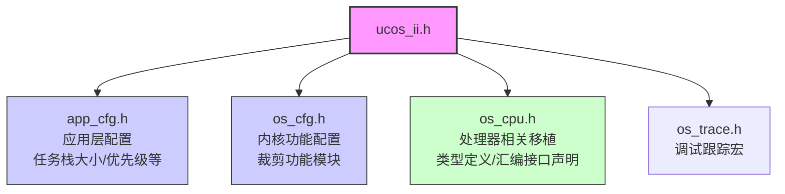
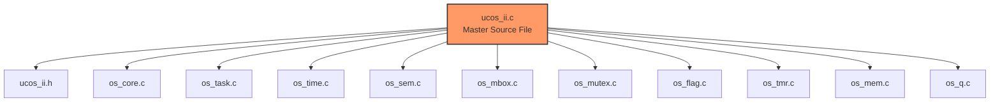
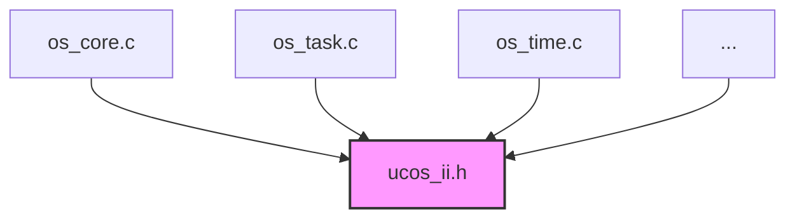

# uC/OS-II 文件调用关系与编译结构说明

本文档描述了 uC/OS-II 实时操作系统内核在 `ucOSii-raw` 目录下的文件调用关系及编译结构。

## 1. 核心头文件依赖 (Header Inclusion)

所有 uC/OS-II 的源文件和移植层文件最终都依赖于 `ucos_ii.h`。它是整个内核的核心配置聚合点。



## 2. 源文件编译模式 (Source Compilation Models)

uC/OS-II 的源文件设计允许两种编译方式。**切勿混用**，否则会导致 `Symbol multiply defined`（符号多重定义）错误。

### 模式 A：Master File 模式（推荐）
只编译 `ucos_ii.c` 一个文件。它通过 `#include` 指令将所有功能模块的 `.c` 文件包含进来一次性编译。这种方式编译器可以进行跨模块优化。

**工程配置：**
*   **添加**：`ucos_ii.c`, `os_cpu_c.c`, `os_cpu_a.asm`
*   **移除**：`os_core.c`, `os_task.c`, `os_time.c` 等所有其他内核源文件



### 模式 B：独立文件模式 (Separate Files)
不使用 `ucos_ii.c`，而是将每个功能模块作为独立的编译单元添加到工程中。

**工程配置：**
*   **添加**：`os_core.c`, `os_task.c`, `os_time.c` 等所有需要的内核源文件
*   **添加**：`os_cpu_c.c`, `os_cpu_a.asm`
*   **移除**：`ucos_ii.c`



## 3. 移植层文件 (Port Files)

移植层文件负责连接 uC/OS-II 内核与具体的硬件（如 ARM Cortex-M4）。这些文件必须包含在工程中，且通常独立编译。

*   **`os_cpu_c.c`**: 
    *   包含 C 语言实现的底层钩子函数和栈初始化函数（如 `OSTaskStkInit`）。
    *   包含 `ucos_ii.h` 以获取内核数据结构定义。
*   **`os_cpu_a.asm`**: 
    *   包含汇编语言实现的上下文切换函数（如 `OSCtxSw`, `OSStartHighRdy`, `PendSV_Handler`）。
    *   引用 `ucos_ii.h` 中声明的全局变量（如 `OSRunning`, `OSTCBCur`）。

## 4. 目录结构概览

```
ucOSii-raw/
├── Source/                 # 内核源代码
│   ├── ucos_ii.h          # 核心头文件
│   ├── ucos_ii.c          # Master File (模式A用)
│   ├── os_core.c          # 核心调度逻辑 (模式B用)
│   ├── os_task.c          # 任务管理 (模式B用)
│   └── ...                # 其他功能模块
├── Ports/                  # 移植文件
│   └── ARM-Cortex-M/
│       └── ARMv7-M/
│           ├── os_cpu.h   # 移植头文件
│           ├── os_cpu_c.c # C 移植文件
│           └── os_cpu_a.asm # 汇编移植文件
└── Cfg/                    # 配置模板
    └── Template/
        ├── os_cfg.h       # 内核配置模板
        └── app_cfg.h      # 应用配置模板
```
