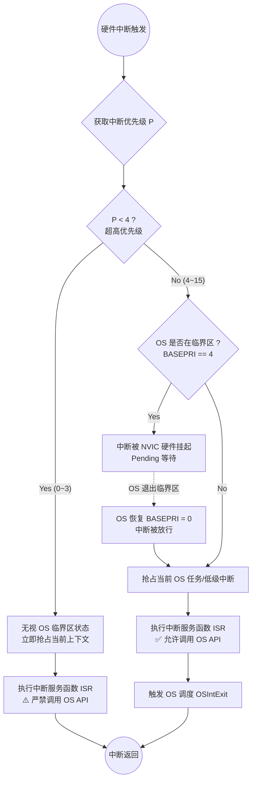

# STM32 NVIC 配置与中断机制详解 (结合 uC/OS-II)

在 STM32 裸机开发以及引入实时操作系统（如 uC/OS-II）时，理解 NVIC（嵌套向量中断控制器）的工作原理至关重要。本文将结合底层硬件设计与操作系统调度，为你彻底理清 STM32 的中断优先级机制。

---

## 1. 硬件底层：为什么是 16 个优先级？

在 ARM Cortex-M 架构的官方规范中，每个中断的优先级是由一个 8 位的寄存器控制的，理论上支持 256 个优先级。
但为了节省芯片成本，**STM32 实际上只使用了这 8 位寄存器的高 4 位（Bit 4 ~ Bit 7）**，低 4 位在硬件上固定为 0。

- 因为只用了 4 个有效位（即 `CPU_CFG_NVIC_PRIO_BITS = 4`），所以能表示的绝对物理优先级数量为 $2^4 = 16$ 个。
- 这 16 个优先级的范围是 **0 ~ 15**。
- **核心原则：数字越小，优先级越高！**（0 为最高优先级，15 为最低优先级）。

---

## 2. 软件逻辑：抢占优先级与响应优先级

为了让这 16 个优先级更灵活，STM32 官方库引入了“优先级分组（Priority Grouping）”的概念，将这宝贵的 4 个 bit 人为切分为两部分：

1. **抢占优先级（Preemption Priority）**：决定一个中断能否**打断**正在执行的另一个低优先级中断。
2. **响应优先级（Sub Priority）**：当两个中断**同时发生**时，抢占优先级相同的，响应优先级高的先执行（但不能相互打断）。

STM32 提供了 5 种分组方式（通常通过 `NVIC_PriorityGroupConfig()` 配置）：

| 分组方式 | 抢占优先级位数 | 响应优先级位数 | 抢占优先级范围 | 响应优先级范围 |
| :--- | :---: | :---: | :---: | :---: |
| **Group 0** | 0 bit | 4 bits | 0 | 0 ~ 15 |
| **Group 1** | 1 bit | 3 bits | 0 ~ 1 | 0 ~ 7 |
| **Group 2** | 2 bits | 2 bits | 0 ~ 3 | 0 ~ 3 |
| **Group 3** | 3 bits | 1 bit | 0 ~ 7 | 0 ~ 1 |
| **Group 4** | 4 bits | 0 bit | **0 ~ 15** | 0 |

> **💡 在 uC/OS 中的最佳实践：**
> 引入 uC/OS 时，强烈建议将分组配置为 **Group 4**（全部 4 位用于抢占优先级）。此时没有响应优先级的概念，逻辑上的抢占优先级就等同于硬件的 16 个物理优先级，这极大地方便了内核对中断的精准管控。

---

## 3. uC/OS 的视角：内核感知边界（KA_IPL_BOUNDARY）

当操作系统介入后，系统里的中断被一条“三八线”划分为两大阵营。这条界限就是 `CPU_CFG_KA_IPL_BOUNDARY`（通常设为 4）。

- **阵营 A：超高优先级中断（优先级 0 ~ 3）**
  - **特权**：它们不受 OS 管控。即使 OS 正在执行临界区代码（关闭了受控中断），它们依然可以强行打断 OS 执行！
  - **禁忌**：**绝对不能**在这些中断的 ISR 中调用任何 uC/OS 的 API（如 `OSSemPost`），否则会导致系统数据结构崩溃。
  - **场景**：用于极其紧急、对延迟零容忍的纯硬件操作（如电机紧急停机、极高速 ADC 采样）。

- **阵营 B：内核感知中断（优先级 4 ~ 15）**
  - **受控**：当 uC/OS 进入临界区时，会通过设置 `BASEPRI` 寄存器屏蔽这些中断，保护系统核心数据。
  - **权限**：在这些中断的 ISR 中，**可以安全地调用 uC/OS 的 API** 来与任务进行通信或触发调度。
  - **SysTick**：作为 OS 的心跳，SysTick 的优先级通常被设置为这个边界值（如 4）或最低优先级（15），以确保它属于受控中断阵营。

---

## 4. 中断处理机制流程图

下面通过 Mermaid 流程图，直观展示当一个硬件中断触发时，系统是如何结合 NVIC 和 uC/OS 机制进行处理的：

---

**总结**：
理解了 STM32 的 NVIC 分组与 uC/OS 的边界隔离机制，就能在设计四轴飞行器等复杂系统时，从容应对底层传感器的高速中断和上层姿态解算任务的调度，确保系统既**实时**又**稳定**！

| 中断类型 | 优先级 | 说明 |
| :--- | :--- | :--- |
| **非内核感知中断** | `0` ~ `3` | 优先级最高，响应极快，但不允许调用 OS 相关的 API（受 `CPU_CFG_KA_IPL_BOUNDARY` 保护）。 |
| **SysTick** | `4` | 系统的“心跳”，在允许调用 OS 函数的中断里优先级最高。 |
| **普通外设中断** | `5` ~ `14` | 其他普通的硬件中断（如串口、SPI等），可调用部分带有 `OS_XXX_Post()` 后缀的 OS API。 |
| **PendSV中断** | `15` | 最低优先级，用于 OS 任务调度和系统维护。 |